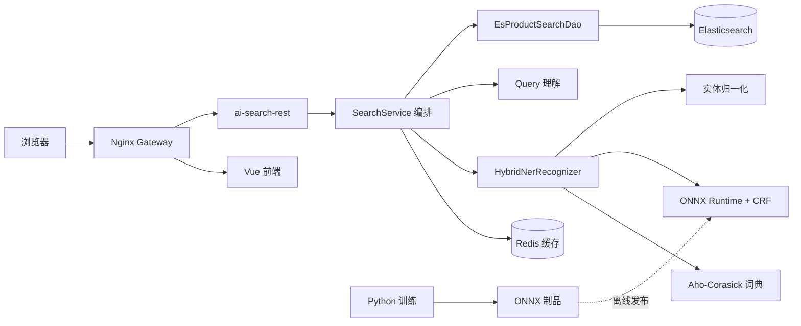

<div align="center">

# Vemall AI Search

面向电商场景的智能搜索系统，提供查询理解、NER 实体识别、Elasticsearch 检索、
筛选聚合和搜索链路可视化。

[](https://www.oracle.com/java/)
[](https://spring.io/projects/spring-boot)
[](https://v2.vuejs.org/)
[](https://www.elastic.co/elasticsearch)
[](https://docs.docker.com/compose/)

</div>

## 项目简介

一次搜索请求被拆分为可观察的处理链路：

1. 词典或 ONNX 模型识别品牌、品类、修饰词和属性等实体；
2. 实体归一化（别名 → 标准值 / 业务 ID）、同义词扩展与查询改写；
3. 按实体类型构造 Elasticsearch 查询：品牌 MUST、品类短语约束、配件排除硬过滤；
4. Redis 版本化缓存与热搜词预热；
5. Vue 页面展示商品结果，调试页展示各阶段中间信息与真实下发的 ES DSL。

实体识别按「词典 → ONNX 模型」分层兜底：模型未就绪或推理异常时自动回退词典，
搜索链路不中断。NER 推理运行在 Java 进程内，Python 只负责离线数据处理、模型训练和
ONNX 导出，**不需要部署 Python 服务**。

架构与链路细节见 [docs/ARCHITECTURE.md](docs/ARCHITECTURE.md)。

## 功能特性

- **搜索链路**：NER → Query 理解 → ES 检索 → SPU 去重，各阶段耗时与中间结果可观测；
- **配件排除硬约束**：搜「手机」不出手机壳、手机膜、手机支架 —— 用 `must_not` 短语过滤，
  不依赖 BM25 分数；两层词表（通用后缀 + 品类特化）可直接编辑，无需改代码；
- **Java ONNX Runtime 推理**：BIOES 解码、CRF 维特比、RaNER 标签映射与置信度阈值；
- **Aho-Corasick 词典识别**：9.6 万条词典，模型异常时自动降级；
- **实体归一化**：别名映射到标准值与业务 ID，含计量单位规则（`3匹` → `3 HP`）；
- **Redis 版本化缓存**：索引/词典/模型/规则任一版本变更即自然失效，TTL 带随机抖动防雪崩；
- **降级可见**：Redis 不可用仍返回结果并在 `degradeReasons` 中标记，ES 不可用如实返回 503；
- 品牌、品类、价格区间、库存筛选，以及相关度/价格/销量/评分排序与分页；
- Elasticsearch IK 中文分词；
- Label Studio 多人标注、冲突仲裁、数据校验、切分和评测工具；
- Docker Compose 健康检查、持久化、资源限制和自动重启。

## 系统架构



模块依赖方向固定为 `rest → server.service → server.dao → ES/Redis`，`fccapi` 不依赖任何模块。

## 技术栈

| 模块 | 技术 |
| --- | --- |
| 前端 | Vue 2.7、Element UI、Axios、SCSS |
| 后端 | Java 8、Spring Boot 2.7、Maven 多模块 |
| 搜索 | Elasticsearch 8.12（客户端 HLRC 7.17，带 8.x 兼容头）、IK Analyzer |
| NER | ONNX Runtime Java 1.26、WordPiece、Aho-Corasick、CRF Viterbi |
| 缓存 | Redis 7 |
| 模型训练 | Python 3.11、PyTorch、Transformers、AdaSeq（RaNER） |
| 标注 | Label Studio |
| 网关与部署 | Nginx、Docker Compose |

## 目录结构

```text
ai-search/
├── ai-search-fccapi/     api 层：对外接口契约（search / debug 各 3 文件）
├── ai-search-feign/      外部服务调用层（本期为空）
├── ai-search-server/     核心：config / dao / service（ner、query、cache）
├── ai-search-rest/       启动类、接口实现、assembler、全局异常处理
├── ai-search-scheduled/  定时任务层（本期为空）
├── frontend/             Vue 搜索前端与调试页
├── model-training/
│   └── product-ner/      NER 训练、评测与 ONNX 导出（唯一主干）
├── services/
│   └── file-service/     训练数据与模型交付包的共享中转（FastAPI）
├── deploy/               elasticsearch / nginx / scripts / systemd
├── docs/                 架构、接口、部署、协作规范
├── Dockerfile            后端多模块镜像（在仓库根构建）
├── compose.yml           单机完整部署
├── compose.shared.yml    共享基础设施（ES / Redis / Kibana）
├── compose.apps.yml      应用层，可独立发版
└── compose.staging.yml   并行验收部署
```

## 快速开始（本地单机）

> 面向新成员在自己电脑上完整跑一遍。日常开发不需要每次都起全套，见[本地开发](#本地开发)。

**环境要求**：Docker Engine（含 Compose v2）、Windows 10/11 或 Linux、建议 ≥ 12 GB 可用内存。
本地开发另需 JDK 8+、Maven 3.8+、Node.js 18+。

```bash
git clone https://gitee.com/jump20020718/ai-search.git
cd ai-search
cp .env.example .env
docker compose -f compose.yml up -d
docker compose -f compose.yml ps
```

默认入口：

| 服务 | 地址 |
| --- | --- |
| 网关导航页 | http://127.0.0.1:18080/ |
| 搜索前端 | http://127.0.0.1:18080/search/ |
| 链路调试页 | http://127.0.0.1:18080/search/debug |
| 健康检查 | http://127.0.0.1:18080/actuator/health |

网关根路径是导航页，带各服务的实时健康灯；前端本身挂在 `/search/` 前缀下，直接访问
**前端容器**的根路径会返回 404，这是预期行为。网关上未定义的路径一律 404 —— 不要改回
`try_files ... /index.html` 那种兜底，那会让已下线的路由看起来全是 200。

停止：`docker compose -f compose.yml down`（不会删除挂载的数据）。

**索引数据**：容器起来后 ES 是空的，搜索会返回 0 条。商品索引的创建与导入由外部流程负责，
本仓库不提供导入程序。索引 mapping 对搜索效果有实质影响（尤其 `title` 的分词器配置），
详见 [docs/DEPLOYMENT.md](docs/DEPLOYMENT.md#索引数据导入)。

## 本地开发

多数情况下**不需要在本地起 ES/Redis 容器**。按角色选择最省资源的方式：

| 你要改 | 本地起什么 | 数据来源 |
| --- | --- | --- |
| 前端 | `npm run serve` | 代理到后端 `/api` |
| 后端 | `mvn spring-boot:run` | **SSH 隧道**复用服务器共享 ES/Redis |

**后端开发（推荐，本地零容器）**：ES/Redis 在服务器上只绑回环地址，通过 SSH 隧道安全访问，
不直接暴露公网。先开隧道，再本地启动后端。

```powershell
# 在PowerShell中运行下面命令
# 在外网：经 Cloudflare Tunnel 的 SSH 入口（本机需先装 cloudflared，并且将私钥文件（ai-search-tunnel）放在指定路径然后这个终端会一直运行着）
ssh -N -i $env:USERPROFILE\.ssh\ai-search-tunnel -L 19200:127.0.0.1:19200 -L 16379:127.0.0.1:16379 -o ProxyCommand="cloudflared access ssh --hostname ssh.tsong.xyz" tunnel@ssh.tsong.xyz

# 隧道建立后，另一个终端启动后端（环境变量必须和 mvn 在同一个终端里设置，否则不生效；
# 也可以改在 IDE 的运行配置里填）
$env:ES_HOST="127.0.0.1"; $env:ES_PORT="19200"
$env:REDIS_HOST="127.0.0.1"; $env:REDIS_PORT="16379"
$env:REDIS_DATABASE="3"      # 必须与他人错开：db0 是生产结果缓存，写进去会污染线上
mvn -pl ai-search-rest -am spring-boot:run
```

也可以先 `mvn -DskipTests package`，再 `java -jar ai-search-rest/target/*.jar`，效果相同。

多人共用同一 ES 时，各自使用不同 `ES_INDEX` 和 `REDIS_DATABASE` 避免互相踩，详见
[docs/GIT_WORKFLOW.md](docs/GIT_WORKFLOW.md)。**共享 ES 不适合破坏性测试。**

**前端开发**：

```bash
cd frontend
npm ci
npm run serve      # vue.config.js 将 /api 代理到 localhost:8080
```

**接口示例**。请求体必须是 UTF-8；Windows 终端直接用 `-d '中文'` 会按 GBK 编码导致 400，
建议写入文件后用 `--data-binary @file`：

```bash
curl -X POST http://localhost:8080/api/search \
  -H "Content-Type: application/json; charset=utf-8" \
  --data-binary @query.json
```

对外只有两个业务接口，完整契约与错误码见 [docs/API.md](docs/API.md)：

| 方法与路径 | 用途 |
| --- | --- |
| `POST /api/search` | 商品搜索（唯一生产接口） |
| `POST /api/debug/pipeline` | 搜索链路可视化（内网调试） |
| `POST /api/ops/cache/warmup` | 热搜词缓存预热（运维操作） |
| `GET /actuator/health` | 健康检查，含 ES 与 Redis 状态 |

## 配置项（常用）

完整清单见 `.env.example`。所有外部依赖地址均可用环境变量覆盖，这是远程复用 ES/Redis 的前提。

| 环境变量 | 默认值 | 说明 |
| --- | --- | --- |
| `ES_HOST` / `ES_PORT` | `localhost` / `9200` | Elasticsearch 地址 |
| `ES_INDEX` | `products_v2` | 商品索引 |
| `REDIS_HOST` / `REDIS_PORT` | `localhost` / `6379` | Redis 地址 |
| `REDIS_DATABASE` | `0` | Redis 逻辑库；共享实例上按环境区分 |
| `NER_MODE` | `hybrid` | `dictionary` / `model` / `hybrid` / `shadow` |
| `NER_MODEL_ENABLED` | `false` | 是否加载 ONNX 模型 |
| `NER_MODEL_VERSION` | `none` | 模型版本标识 |
| `SEARCH_INDEX_VERSION` 等 | `unknown` | 缓存 key 的版本维度，变更即让旧缓存失效 |
| `SEARCH_WARMUP_ON_STARTUP` | `false` | 启动时是否预热热搜词缓存 |
| `GATEWAY_BIND_ADDRESS` | `127.0.0.1` | 网关绑定地址，**勿改 0.0.0.0** |
| `GATEWAY_PORT` | `18080` | 网关宿主机端口 |

## 部署与运维

生产部署采用**共享层 + 应用层**分层的两个 Compose 项目，应用层可独立发版而不影响 ES/Redis。
服务器只拉取 CI 构建的不可变镜像，不在服务器上构建。完整流程见：

- [docs/DEPLOYMENT.md](docs/DEPLOYMENT.md) — 编排方式、环境变量、发布、备份恢复、索引导入
- [docs/RUNBOOK.md](docs/RUNBOOK.md) — 重启后如何恢复、手动启停、排障顺序、不要做的事
- [docs/ARCHITECTURE.md](docs/ARCHITECTURE.md) — 分层结构、搜索链路、降级矩阵、缓存设计
- [docs/API.md](docs/API.md) — 接口契约、请求响应示例、错误码
- [docs/GIT_WORKFLOW.md](docs/GIT_WORKFLOW.md) — 分支模型、提交规范、PR 与发版流程

## 贡献

从 `dev` 切功能分支，完成后提 PR 回 `dev`；`main` 为生产分支，仅通过 PR 合入并触发自动部署。
提交信息使用 Conventional Commits。详见 [docs/GIT_WORKFLOW.md](docs/GIT_WORKFLOW.md)。

```bash
git checkout dev && git pull
git checkout -b feat/your-feature
```
