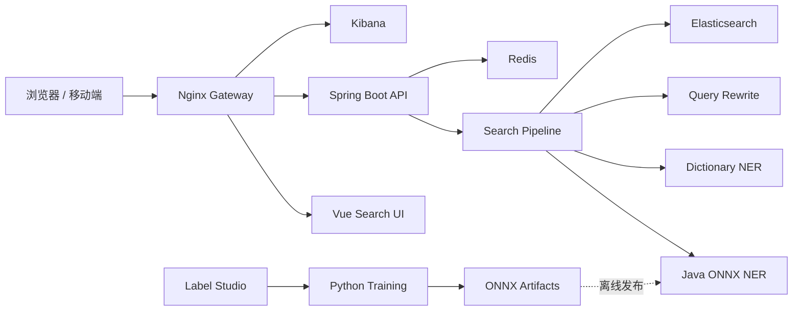

<div align="center">

# Vemall AI Search

面向电商场景的智能搜索系统，提供查询理解、NER 实体识别、Elasticsearch 检索、
筛选聚合和搜索链路可视化。

[](https://www.oracle.com/java/)
[](https://spring.io/projects/spring-boot)
[](https://v2.vuejs.org/)
[](https://onnxruntime.ai/)
[](https://www.elastic.co/elasticsearch)
[](https://docs.docker.com/compose/)

[在线入口](https://ai-search.tsong.xyz/) ·
[搜索页面](https://ai-search.tsong.xyz/search/) ·
[Kibana](https://ai-search.tsong.xyz/kibana/)

</div>

## 项目简介

Vemall AI Search 将一次搜索请求拆分为可观察的处理链路：

1. 使用词典或 ONNX 模型识别品牌、类目、商品类型和属性等实体；
2. 根据实体和同义词完成查询改写与字段权重计算；
3. 调用 Elasticsearch 完成召回、排序、筛选和聚合；
4. 在 Vue 页面展示商品结果及各阶段中间信息。

线上推理完全运行在 Java 进程内。Python 只负责离线数据处理、模型训练和 ONNX
导出，不需要部署 Python Web 服务。

## 功能特性

- 电商搜索 Pipeline：NER、查询改写、ES 分词、召回和聚合结果统一返回；
- Java ONNX Runtime 推理，支持 BIO/BIOES 标签解码与置信度阈值；
- Aho-Corasick 词典识别和模型异常自动降级；
- 品牌、类目、价格筛选以及默认、价格升降序排序；
- Elasticsearch IK 中文分词；
- Label Studio 多人标注、冲突仲裁、数据校验、切分和评测工具；
- Nginx 统一网关，集中代理前端、后端 API 和 Kibana；
- Docker Compose 健康检查、持久化、资源限制和自动重启；
- Windows 启动恢复、状态检查和维护计划脚本。

## 系统架构



## 目录结构

```text
vemall-ai-search/
├── frontend/                     Vue 搜索前端
│   ├── public/
│   └── src/
│       ├── api/
│       ├── components/
│       ├── router/
│       ├── styles/
│       └── views/
├── backend/                      Java 搜索服务与部署配置
│   ├── src/main/java/com/tsong/aisearch/
│   │   ├── config/
│   │   ├── controller/
│   │   ├── model/dto/
│   │   ├── repository/
│   │   └── service/
│   │       ├── ner/
│   │       ├── query/
│   │       └── recall/
│   ├── src/test/
│   └── deploy/
│       ├── elasticsearch/
│       ├── nginx/
│       └── scripts/
├── model-training/               Python NER 训练工作区
│   ├── annotation/
│   ├── artifacts/
│   ├── data/
│   ├── src/
│   └── tests/
├── compose.yml                   生产部署
└── compose.staging.yml           并行验收部署
```

## 技术栈

| 模块 | 技术 |
| --- | --- |
| 前端 | Vue 2.7、Element UI、Axios、SCSS |
| 后端 | Java、Spring Boot 2.7、Maven |
| 搜索 | Elasticsearch 8.12、IK Analyzer |
| NER | ONNX Runtime Java、WordPiece、Aho-Corasick |
| 缓存 | Redis 7 |
| 模型训练 | Python、PyTorch、Transformers、Datasets、Seqeval |
| 标注 | Label Studio |
| 网关与部署 | Nginx、Docker Compose、Cloudflare Tunnel |

## 快速开始

### 1. 环境要求

- Windows 10/11 或 Linux；
- Docker Desktop / Docker Engine，支持 Docker Compose v2；
- 建议至少 8 GB 可用内存；
- 本地开发需要 JDK 8+、Maven 3.8+、Node.js 18+；
- 模型训练建议使用 Python 3.10+ 和 NVIDIA GPU。

### 2. 克隆项目

```bash
git clone -b dev https://github.com/tansong33/vemall-ai-search.git
cd vemall-ai-search
```

### 3. 准备持久化目录

当前 Compose 默认把数据和日志放在 Windows `E:` 盘：

```powershell
$directories = @(
  'E:\ai-search-data\elasticsearch',
  'E:\ai-search-data\redis',
  'E:\ai-search-data\credentials',
  'E:\ai-search-data\ner\models\production',
  'E:\ai-search-next-data\logs\backend',
  'E:\ai-search-next-data\logs\nginx'
)
$directories | ForEach-Object {
  New-Item -ItemType Directory -Path $_ -Force | Out-Null
}
```

Linux 或其他磁盘环境需要先修改 `compose.yml` 中的宿主机挂载路径。

创建 `E:\ai-search-data\credentials\nginx.htpasswd`，用于保护 Kibana。可以使用
Apache `htpasswd` 或其他兼容工具生成 bcrypt 格式的用户名密码。

创建 `E:\ai-search-data\credentials\kibana.env`：

```dotenv
XPACK_ENCRYPTEDSAVEDOBJECTS_ENCRYPTIONKEY=replace-with-at-least-32-random-characters
XPACK_REPORTING_ENCRYPTIONKEY=replace-with-at-least-32-random-characters
XPACK_SECURITY_ENCRYPTIONKEY=replace-with-at-least-32-random-characters
```

不要把真实密码、密钥、ES 数据或模型二进制提交到 Git。

### 4. 启动完整服务

```powershell
docker compose -f compose.yml up -d --build
docker compose -f compose.yml ps
```

默认入口：

| 服务 | 地址 |
| --- | --- |
| 网关首页 | http://127.0.0.1:18080/ |
| 搜索前端 | http://127.0.0.1:18080/search/ |
| 后端健康检查 | http://127.0.0.1:18080/backend-health |
| 网关健康检查 | http://127.0.0.1:18080/health |
| Kibana | http://127.0.0.1:18080/kibana/ |

停止服务：

```powershell
docker compose -f compose.yml down
```

`down` 不会删除挂载在宿主机上的 Elasticsearch、Redis 和模型数据。

## 本地开发

### Java 后端

确保本机 Elasticsearch 和 Redis 可用，然后执行：

```powershell
cd backend
mvn spring-boot:run
```

默认监听 `http://localhost:8080`。如果 `products_v2` 索引尚未导入数据，接口可以
正常启动，但搜索结果为空。

### Vue 前端

```powershell
cd frontend
npm ci
npm run serve
```

开发服务器通过 `vue.config.js` 将 `/api` 代理到 `localhost:8080`。

### 搜索接口示例

```bash
curl -X POST http://localhost:8080/api/search/pipeline \
  -H "Content-Type: application/json" \
  -d '{"query":"公牛插座","sort":"default","filters":{}}'
```

主要接口：

| 方法 | 路径 | 说明 |
| --- | --- | --- |
| POST | `/api/search/pipeline` | 完整搜索链路 |
| POST | `/api/search/ner` | NER 实体识别 |
| POST | `/api/search/analyze` | Elasticsearch 分词分析 |
| GET | `/api/admin/ner/status` | NER 模式与模型状态 |
| GET | `/actuator/health` | 后端健康检查 |

## NER 模型训练

Python 环境只在训练机器上使用：

```powershell
cd model-training
python -m venv .venv
.\.venv\Scripts\Activate.ps1
pip install -r requirements.txt
```

训练 Hugging Face token-classification 模型：

```powershell
python src/train.py `
  --train E:\ai-search-data\ner\datasets\v1\train.jsonl `
  --validation E:\ai-search-data\ner\datasets\v1\validation.jsonl `
  --base-model hfl/chinese-macbert-base `
  --output-dir E:\ai-search-data\ner\models\ner-v1
```

导出 Java 可加载的 ONNX 制品：

```powershell
python src/export_onnx.py `
  --checkpoint E:\ai-search-data\ner\models\ner-v1 `
  --output-dir E:\ai-search-data\ner\models\production `
  --model-version ner-v1
```

最小运行制品：

```text
model.onnx
vocab.txt
labels.json
model-metadata.json
SHA256SUMS
```

启用模型：

```powershell
$env:NER_ONNX_ENABLED='true'
$env:NER_MODE='hybrid'
$env:NER_MODEL_VERSION='ner-v1'
docker compose -f compose.yml up -d backend gateway
```

`hybrid` 模式优先采用模型结果，再用词典补充不重叠实体；模型缺失或推理异常时
自动回退到词典。

Label Studio 标注和数据转换流程见
[`model-training/annotation/LABEL_STUDIO_WORKFLOW.md`](model-training/annotation/LABEL_STUDIO_WORKFLOW.md)。

## 配置项

| 环境变量 | 默认值 | 说明 |
| --- | --- | --- |
| `ES_HOST` | `localhost` | Elasticsearch 主机 |
| `ES_PORT` | `9200` | Elasticsearch 端口 |
| `ES_INDEX` | `products_v2` | 商品索引 |
| `REDIS_HOST` | `localhost` | Redis 主机 |
| `NER_MODE` | `hybrid` | `dictionary`、`model`、`hybrid` 或 `shadow` |
| `NER_ONNX_ENABLED` | `false` | 是否加载 ONNX 模型 |
| `NER_ONNX_MODEL` | `/app/models/ner/model.onnx` | ONNX 模型路径 |
| `NER_ONNX_VOCAB` | `/app/models/ner/vocab.txt` | WordPiece 词表路径 |
| `NER_ONNX_LABELS` | `/app/models/ner/labels.json` | 标签映射路径 |
| `NER_ONNX_CONFIDENCE` | `0.75` | 实体置信度阈值 |
| `NER_MODEL_VERSION` | `none` | 模型版本标识 |

## 测试

后端测试：

```powershell
mvn -f backend/pom.xml test
```

模型数据流程测试：

```powershell
$env:PYTEST_DISABLE_PLUGIN_AUTOLOAD='1'
python -m pytest model-training/tests -q
```

前端生产构建：

```powershell
cd frontend
npm ci
npm run build
```

## 部署与运维

`backend/deploy/scripts` 提供以下 PowerShell 脚本：

| 脚本 | 用途 |
| --- | --- |
| `start-server.ps1` | 等待 Docker 就绪并恢复服务 |
| `stop-server.ps1` | 停止 Compose 服务 |
| `status-server.ps1` | 检查容器和公网状态 |
| `resume-server.ps1` | Windows 唤醒后恢复服务 |
| `cutover.ps1` | 健康检查、数据量校验和失败回滚 |
| `update-maintenance-schedule.ps1` | 按北京时间维护计划任务 |

生产环境建议只向本机回环地址暴露 Nginx，再通过 Cloudflare Tunnel、VPN 或其他
受控反向代理提供公网访问。Elasticsearch、Redis、Java 后端和 Kibana 不应直接暴露
到公网。

## 贡献

请从 `dev` 创建功能分支，完成测试后提交 Pull Request：

```bash
git checkout dev
git pull
git checkout -b feature/your-feature
```

提交信息建议采用 Conventional Commits，例如：

```text
feat: add query intent classification
fix: handle missing ONNX artifacts
docs: update deployment guide
```
