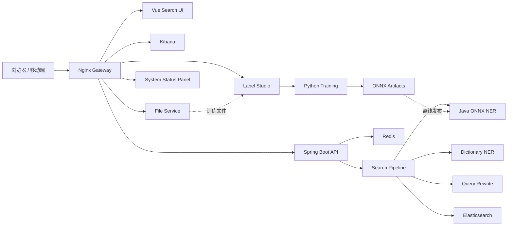

<div align="center">

# Vemall AI Search

面向电商场景的智能搜索系统，提供查询理解、NER 实体识别、Elasticsearch 检索、
筛选聚合和搜索链路可视化。

[](https://www.oracle.com/java/)
[](https://spring.io/projects/spring-boot)
[](https://v2.vuejs.org/)
[](https://www.elastic.co/elasticsearch)
[](https://docs.docker.com/compose/)

[在线入口](https://ai-search.tsong.xyz/) · [搜索页面](https://ai-search.tsong.xyz/search/)

</div>

## 项目简介

Vemall AI Search 将一次搜索请求拆分为可观察的处理链路：

1. 使用词典或 ONNX 模型识别品牌、类目、商品类型和属性等实体；
2. 根据实体和同义词完成查询改写与字段权重计算；
3. 调用 Elasticsearch 完成召回、排序、筛选和聚合；
4. 在 Vue 页面展示商品结果及各阶段中间信息。

线上推理完全运行在 Java 进程内。Python 只负责离线数据处理、模型训练和 ONNX
导出，不需要部署 Python Web 服务。

## 功能特性

- 电商搜索 Pipeline：NER、查询改写、ES 分词、召回和聚合结果统一返回；
- Java ONNX Runtime 推理，支持 BIO/BIOES 标签解码与置信度阈值；
- Aho-Corasick 词典识别和模型异常自动降级；
- 品牌、类目、价格筛选以及默认、价格升降序排序；
- Elasticsearch IK 中文分词；
- Label Studio 多人标注、冲突仲裁、数据校验、切分和评测工具；
- 带浏览器界面的文件上传/下载服务，与 Label Studio 共享受控数据目录；
- Nginx 统一网关，集中代理前端、后端 API、Kibana、Label Studio 和文件中心；
- 网关运行状态面板，持续探测各依赖服务；
- Docker Compose 健康检查、持久化、资源限制和自动重启。

## 系统架构



## 技术栈

| 模块 | 技术 |
| --- | --- |
| 前端 | Vue 2.7、Element UI、Axios、SCSS |
| 后端 | Java、Spring Boot 2.7、Maven |
| 搜索 | Elasticsearch 8.12、IK Analyzer |
| NER | ONNX Runtime Java、WordPiece、Aho-Corasick |
| 缓存 | Redis 7 |
| 模型训练 | Python、PyTorch、Transformers、Datasets、Seqeval |
| 标注 | Label Studio |
| 网关与部署 | Nginx、Docker Compose、Cloudflare Tunnel |

## 目录结构

```text
ai-search/
├── frontend/            Vue 搜索前端
├── backend/             Java 搜索服务与部署配置
│   └── deploy/          elasticsearch / nginx / scripts / systemd
├── model-training/      Python NER 训练工作区
│   └── product-ner/     完整商品 NER 训练、评测与 ONNX 交付子项目
├── services/
│   └── file-service/    受网关保护的上传/下载服务
├── .github/workflows/   CI、镜像发布
├── docs/                协作规范、上传边界与灾难恢复
├── compose.yml          单机完整部署
├── compose.shared.yml   服务器共享基础设施（ES/Redis/Kibana/LS/文件服务）
├── compose.apps.yml     可独立更新的应用层（前端/后端/网关）
└── compose.staging.yml  并行验收部署
```

## 快速开始（本地单机）

> 面向新成员在自己电脑上完整跑一遍。日常开发不需要每次都起全套，见
> [本地开发](#本地开发)。

**环境要求**：Docker Engine（含 Compose v2）、Windows 10/11 或 Linux、
建议 ≥ 12 GB 可用内存。本地开发另需 JDK 8+、Maven 3.8+、Node.js 18+。

```bash
git clone https://gitee.com/jump20020718/ai-search.git
cd ai-search
cp .env.example .env
docker compose -f compose.yml up -d
docker compose -f compose.yml ps
```

默认入口：

| 服务 | 地址 |
| --- | --- |
| 网关首页 | http://127.0.0.1:18080/ |
| 搜索前端 | http://127.0.0.1:18080/search/ |
| 系统状态 | http://127.0.0.1:18080/api/system/status |
| 健康检查 | http://127.0.0.1:18080/health |

停止：`docker compose -f compose.yml down`（不会删除挂载的数据）。

## 本地开发

多数情况下**不需要在本地起 ES/Redis 容器**。按角色选择最省资源的方式：

| 你要改 | 本地起什么 | 数据来源 |
| --- | --- | --- |
| 前端 | `npm run serve` | 代理到后端 `/api` |
| 后端 | `mvn spring-boot:run` | **SSH 隧道**复用服务器共享 ES/Redis |

**后端开发（推荐，本地零容器）**：先开 SSH 隧道复用服务器的共享实例，
再本地启动后端。ES/Redis 在服务器上只绑回环，通过 SSH 隧道安全访问，不直接暴露。

```bash
# 在PowerShell中运行下面命令
# 在外网：经 Cloudflare Tunnel 的 SSH 入口（本机需先装 cloudflared，并且将私钥文件（ai-search-tunnel）放在指定路径然后这个终端会一直运行着）
ssh -N -i $env:USERPROFILE\.ssh\ai-search-tunnel -L 19200:127.0.0.1:19200 -L 16379:127.0.0.1:16379 -o ProxyCommand="cloudflared access ssh --hostname ssh.tsong.xyz" tunnel@ssh.tsong.xyz

# 隧道建立后，另一个终端启动后端（mvn spring-boot:run要在这个终端中运行，否则配置不起效；或者在springboot启动中配置）
cd backend
$env:ES_HOST="127.0.0.1"; $env:ES_PORT="19200"; $env:REDIS_HOST="127.0.0.1"; $env:REDIS_PORT="16379"; mvn spring-boot:run
```

多人共用同一 ES 时，各自使用不同 `ES_INDEX` 和 `REDIS_DATABASE` 避免互相踩，
详见 [docs/GIT_WORKFLOW.md](docs/GIT_WORKFLOW.md)。共享 ES 不适合破坏性测试。

**前端开发**：

```bash
cd frontend
npm ci
npm run serve      # vue.config.js 将 /api 代理到 localhost:8080
```

**搜索接口示例**：

```bash
curl -X POST http://localhost:8080/api/search/pipeline \
  -H "Content-Type: application/json" \
  -d '{"query":"公牛插座","sort":"default","filters":{}}'
```

主要接口：`/api/search/pipeline`（完整链路）、`/api/search/ner`、
`/api/search/analyze`、`/api/admin/ner/status`、`/api/system/status`、
`/actuator/health`。

## 配置项（常用）

完整清单见 `.env.example`。

| 环境变量 | 默认值 | 说明 |
| --- | --- | --- |
| `ES_INDEX` | `products_v2` | 商品索引 |
| `REDIS_DATABASE` | `0` | Redis 逻辑库；共享实例上按环境区分 |
| `NER_MODE` | `hybrid` | `dictionary` / `model` / `hybrid` / `shadow` |
| `NER_ONNX_ENABLED` | `false` | 是否加载 ONNX 模型 |
| `NER_MODEL_VERSION` | `none` | 模型版本标识 |
| `GATEWAY_BIND_ADDRESS` | `127.0.0.1` | 网关绑定地址，**勿改 0.0.0.0** |
| `GATEWAY_PORT` | `18080` | 网关宿主机端口 |
| `BACKEND_IMAGE` 等 | 见 `.env.example` | 应用镜像，CI 用不可变 `sha-<commit>` 标签 |

## 部署与运维

生产部署采用**共享层 + 应用层**分层的两个 Compose 项目，应用层可独立发版而不影响
ES/Redis。服务器只拉取 CI 构建的不可变镜像，不在服务器上构建。完整流程见：

- [docs/DISASTER_RECOVERY.md](docs/DISASTER_RECOVERY.md) — 故障后从镜像 + 备份重建
- [docs/GIT_WORKFLOW.md](docs/GIT_WORKFLOW.md) — 分支模型、提交规范、PR 与发版流程
- [docs/REPOSITORY_UPLOAD_POLICY.md](docs/REPOSITORY_UPLOAD_POLICY.md) —
  仓库上传范围与敏感文件检查

## 贡献

从 `dev` 切功能分支，完成后提 PR 回 `dev`；`main` 为生产分支，仅通过 PR 合入并触发
自动部署。提交信息使用 Conventional Commits。详见
[docs/GIT_WORKFLOW.md](docs/GIT_WORKFLOW.md)。

```bash
git checkout dev && git pull
git checkout -b feature/your-feature
```
