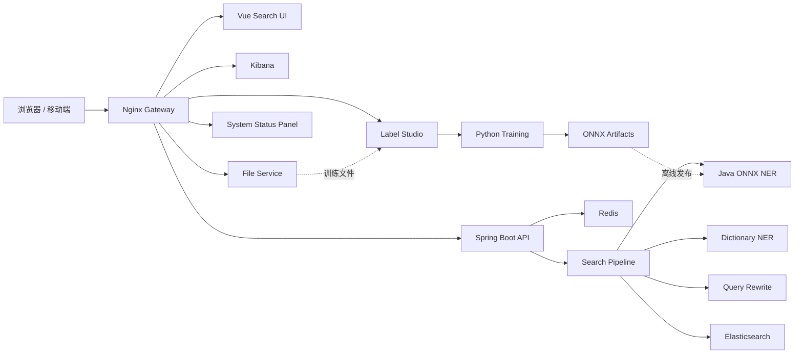

<div align="center">

# Vemall AI Search

面向电商场景的智能搜索系统，提供查询理解、NER 实体识别、Elasticsearch 检索、
筛选聚合和搜索链路可视化。

[](https://www.oracle.com/java/)
[](https://spring.io/projects/spring-boot)
[](https://v2.vuejs.org/)
[](https://onnxruntime.ai/)
[](https://www.elastic.co/elasticsearch)
[](https://docs.docker.com/compose/)

[在线入口](https://ai-search.tsong.xyz/) ·
[搜索页面](https://ai-search.tsong.xyz/search/) ·
[Kibana](https://ai-search.tsong.xyz/kibana/)

</div>

## 项目简介

Vemall AI Search 将一次搜索请求拆分为可观察的处理链路：

1. 使用词典或 ONNX 模型识别品牌、类目、商品类型和属性等实体；
2. 根据实体和同义词完成查询改写与字段权重计算；
3. 调用 Elasticsearch 完成召回、排序、筛选和聚合；
4. 在 Vue 页面展示商品结果及各阶段中间信息。

线上推理完全运行在 Java 进程内。Python 只负责离线数据处理、模型训练和 ONNX
导出，不需要部署 Python Web 服务。

## 功能特性

- 电商搜索 Pipeline：NER、查询改写、ES 分词、召回和聚合结果统一返回；
- Java ONNX Runtime 推理，支持 BIO/BIOES 标签解码与置信度阈值；
- Aho-Corasick 词典识别和模型异常自动降级；
- 品牌、类目、价格筛选以及默认、价格升降序排序；
- Elasticsearch IK 中文分词；
- Label Studio 多人标注、冲突仲裁、数据校验、切分和评测工具；
- 带浏览器界面的文件上传/下载服务，与 Label Studio 共享受控数据目录；
- Nginx 统一网关，集中代理前端、后端 API、Kibana、Label Studio 和文件中心；
- 网关运行状态面板，持续探测 Frontend、Backend、Elasticsearch、Redis、Kibana、Label Studio 和文件服务；
- Docker Compose 健康检查、持久化、资源限制和自动重启；
- Windows 启动恢复、状态检查和维护计划脚本。

## 系统架构



## 目录结构

```text
vemall-ai-search/
├── frontend/                     Vue 搜索前端
│   ├── public/
│   └── src/
│       ├── api/
│       ├── components/
│       ├── router/
│       ├── styles/
│       └── views/
├── backend/                      Java 搜索服务与部署配置
│   ├── src/main/java/com/tsong/aisearch/
│   │   ├── config/
│   │   ├── controller/
│   │   ├── model/dto/
│   │   ├── repository/
│   │   └── service/
│   │       ├── ner/
│   │       ├── query/
│   │       └── recall/
│   ├── src/test/
│   └── deploy/
│       ├── elasticsearch/
│       ├── nginx/
│       ├── scripts/
│       └── systemd/
├── model-training/               Python NER 训练工作区
│   ├── annotation/
│   ├── artifacts/
│   ├── data/
│   ├── src/
│   ├── tests/
│   └── product-ner/              完整商品 NER 训练、评测与 ONNX 交付子项目
├── services/
│   └── file-service/             受网关保护的上传/下载服务
├── .github/workflows/             CI、镜像发布与应用自动部署
├── docs/                          上传边界、服务器重建与恢复手册
├── compose.yml                   单机完整部署
├── compose.shared.yml            服务器共享基础设施
├── compose.apps.yml              可独立更新的应用层
└── compose.staging.yml           并行验收部署
```

## 技术栈

| 模块 | 技术 |
| --- | --- |
| 前端 | Vue 2.7、Element UI、Axios、SCSS |
| 后端 | Java、Spring Boot 2.7、Maven |
| 搜索 | Elasticsearch 8.12、IK Analyzer |
| NER | ONNX Runtime Java、WordPiece、Aho-Corasick |
| 缓存 | Redis 7 |
| 模型训练 | Python、PyTorch、Transformers、Datasets、Seqeval |
| 标注 | Label Studio |
| 网关与部署 | Nginx、Docker Compose、Cloudflare Tunnel |

## 快速开始

### 1. 环境要求

- Windows 10/11 或 Linux；
- Docker Desktop / Docker Engine，支持 Docker Compose v2；
- 建议至少 12 GB 可用内存；
- 本地开发需要 JDK 8+、Maven 3.8+、Node.js 18+；
- 模型训练建议使用 Python 3.10+ 和 NVIDIA GPU。

### 2. 克隆项目

```bash
git clone -b dev https://github.com/tansong33/vemall-ai-search.git
cd vemall-ai-search
```

### 3. 准备持久化目录

当前 Compose 默认把数据和日志放在 Windows `E:` 盘：

```powershell
$directories = @(
  'E:\ai-search-data\elasticsearch',
  'E:\ai-search-data\redis',
  'E:\ai-search-data\files',
  'E:\ai-search-data\credentials',
  'E:\ai-search-data\ner\models\production',
  'E:\label-studio-data',
  'E:\ai-search-next-data\logs\backend',
  'E:\ai-search-next-data\logs\nginx'
)
$directories | ForEach-Object {
  New-Item -ItemType Directory -Path $_ -Force | Out-Null
}
```

Linux 或其他磁盘环境不需要修改 Compose 文件。复制 `.env.example` 为 `.env`，把
`ES_DATA_DIR`、`REDIS_DATA_DIR`、`LABEL_STUDIO_DATA_DIR`、日志和凭据路径改为
`/srv/ai-search/...` 即可。

创建 `E:\ai-search-data\credentials\nginx.htpasswd`，用于保护 Kibana 和文件中心。可以使用
Apache `htpasswd` 或其他兼容工具生成 bcrypt 格式的用户名密码。

创建 `E:\ai-search-data\credentials\kibana.env`：

```dotenv
XPACK_ENCRYPTEDSAVEDOBJECTS_ENCRYPTIONKEY=replace-with-at-least-32-random-characters
XPACK_REPORTING_ENCRYPTIONKEY=replace-with-at-least-32-random-characters
XPACK_SECURITY_ENCRYPTIONKEY=replace-with-at-least-32-random-characters
```

不要把真实密码、密钥、ES 数据或模型二进制提交到 Git。

### 4. 启动完整服务

```powershell
docker compose -f compose.yml up -d --build
docker compose -f compose.yml ps
```

默认入口：

| 服务 | 地址 |
| --- | --- |
| 网关首页 | http://127.0.0.1:18080/ |
| 搜索前端 | http://127.0.0.1:18080/search/ |
| 后端健康检查 | http://127.0.0.1:18080/backend-health |
| 系统状态接口 | http://127.0.0.1:18080/api/system/status |
| 网关健康检查 | http://127.0.0.1:18080/health |
| Kibana | http://127.0.0.1:18080/kibana/ |
| Label Studio | http://127.0.0.1:18080/label-studio/ |
| 文件中心 | http://127.0.0.1:18080/files/ |

停止服务：

```powershell
docker compose -f compose.yml down
```

`down` 不会删除挂载在宿主机上的 Elasticsearch、Redis、Label Studio、共享文件或模型数据。

## 本地开发

### Java 后端

后端开发可以连接本机 Elasticsearch/Redis，也可以通过后文的 SSH 隧道复用服务器
共享实例。环境变量仍使用 `ES_HOST`、`ES_PORT`、`REDIS_HOST` 和 `REDIS_PORT`。
准备完成后执行：

```powershell
cd backend
mvn spring-boot:run
```

默认监听 `http://localhost:8080`。如果 `products_v2` 索引尚未导入数据，接口可以
正常启动，但搜索结果为空。

### Vue 前端

```powershell
cd frontend
npm ci
npm run serve
```

开发服务器通过 `vue.config.js` 将 `/api` 代理到 `localhost:8080`。如果需要直接
使用服务器上的开发后端，可以在启动前设置 `VUE_APP_API_TARGET`。

### 搜索接口示例

```bash
curl -X POST http://localhost:8080/api/search/pipeline \
  -H "Content-Type: application/json" \
  -d '{"query":"公牛插座","sort":"default","filters":{}}'
```

主要接口：

| 方法 | 路径 | 说明 |
| --- | --- | --- |
| POST | `/api/search/pipeline` | 完整搜索链路 |
| POST | `/api/search/ner` | NER 实体识别 |
| POST | `/api/search/analyze` | Elasticsearch 分词分析 |
| GET | `/api/admin/ner/status` | NER 模式与模型状态 |
| GET | `/api/system/status` | Backend、Elasticsearch、Redis 状态和探测延迟 |
| GET | `/actuator/health` | 后端健康检查 |

## NER 模型训练

Python 环境只在训练机器上使用：

```powershell
cd model-training
python -m venv .venv
.\.venv\Scripts\Activate.ps1
pip install -r requirements.txt
```

训练 Hugging Face token-classification 模型：

```powershell
python src/train.py `
  --train E:\ai-search-data\ner\datasets\v1\train.jsonl `
  --validation E:\ai-search-data\ner\datasets\v1\validation.jsonl `
  --base-model hfl/chinese-macbert-base `
  --output-dir E:\ai-search-data\ner\models\ner-v1
```

导出 Java 可加载的 ONNX 制品：

```powershell
python src/export_onnx.py `
  --checkpoint E:\ai-search-data\ner\models\ner-v1 `
  --output-dir E:\ai-search-data\ner\models\production `
  --model-version ner-v1
```

最小运行制品：

```text
model.onnx
vocab.txt
labels.json
model-metadata.json
SHA256SUMS
```

启用模型：

```powershell
$env:NER_ONNX_ENABLED='true'
$env:NER_MODE='hybrid'
$env:NER_MODEL_VERSION='ner-v1'
docker compose -f compose.yml up -d backend gateway
```

`hybrid` 模式优先采用模型结果，再用词典补充不重叠实体；模型缺失或推理异常时
自动回退到词典。

Label Studio 标注和数据转换流程见
[`model-training/annotation/LABEL_STUDIO_WORKFLOW.md`](model-training/annotation/LABEL_STUDIO_WORKFLOW.md)。

`model-training/product-ner` 提供完整的商品 NER 训练和交付工具链，包括去重分层抽样、
弱监督预标、Label Studio 转换、无泄漏切分、实体级评测、ONNX 一致性验证和 Java
交付代码。仓库只保存源码、配置和小型脱敏样例；真实数据、预训练权重、checkpoint、
报告和交付压缩包保存在外部数据盘。

## 配置项

| 环境变量 | 默认值 | 说明 |
| --- | --- | --- |
| `ES_HOST` | `localhost` | Elasticsearch 主机 |
| `ES_PORT` | `9200` | Elasticsearch 端口 |
| `ES_INDEX` | `products_v2` | 商品索引 |
| `REDIS_HOST` | `localhost` | Redis 主机 |
| `REDIS_DATABASE` | `0` | Redis 逻辑库；共享实例上按环境区分 |
| `NER_MODE` | `hybrid` | `dictionary`、`model`、`hybrid` 或 `shadow` |
| `NER_ONNX_ENABLED` | `false` | 是否加载 ONNX 模型 |
| `NER_ONNX_MODEL` | `/app/models/ner/model.onnx` | ONNX 模型路径 |
| `NER_ONNX_VOCAB` | `/app/models/ner/vocab.txt` | WordPiece 词表路径 |
| `NER_ONNX_LABELS` | `/app/models/ner/labels.json` | 标签映射路径 |
| `NER_ONNX_CONFIDENCE` | `0.75` | 实体置信度阈值 |
| `NER_MODEL_VERSION` | `none` | 模型版本标识 |
| `LABEL_STUDIO_HOST` | `https://ai-search.tsong.xyz/label-studio` | Label Studio 经网关访问的完整 URL |
| `LABEL_STUDIO_DATA_DIR` | `E:/label-studio-data` | Label Studio 数据库和上传数据目录 |
| `FILE_SERVICE_DATA_DIR` | `E:/ai-search-data/files` | 文件中心与 Label Studio 共享的宿主机目录 |
| `FILE_SERVICE_MAX_UPLOAD_BYTES` | `1073741824` | 文件中心单文件字节上限 |
| `GATEWAY_BIND_ADDRESS` | `127.0.0.1` | 网关宿主机绑定地址 |
| `GATEWAY_PORT` | `18080` | 网关宿主机端口 |
| `BACKEND_IMAGE` | `ai-search-next-backend:2.0.0` | 应用层后端镜像，可使用 GHCR SHA 标签 |
| `FRONTEND_IMAGE` | `ai-search-next-frontend:2.0.0` | 独立前端镜像，可使用 GHCR SHA 标签 |
| `GATEWAY_IMAGE` | `ai-search-next-gateway:2.0.0` | 稳定网关镜像 |
| `ELASTICSEARCH_IMAGE` | `ai-search-next-elasticsearch:8.12.0` | 带 IK 插件的共享 ES 镜像 |
| `FILE_SERVICE_IMAGE` | `ai-search-next-file-service:1.0.0` | 共享文件服务镜像 |

## 测试

后端测试：

```powershell
mvn -f backend/pom.xml test
```

模型数据流程测试：

```powershell
$env:PYTEST_DISABLE_PLUGIN_AUTOLOAD='1'
python -m pytest model-training/tests -q
```

商品 NER 完整工具链测试：

```powershell
cd model-training/product-ner
python -m pytest tests -q
```

前端生产构建：

```powershell
cd frontend
npm ci
npm run build
```

## 部署与运维

### 服务分层

服务器部署分成两个生命周期不同的 Compose 项目：

| 层级 | Compose 文件 | 服务 | 更新策略 |
| --- | --- | --- | --- |
| 共享基础设施 | `compose.shared.yml` | Elasticsearch、Redis、Kibana、Label Studio、文件服务 | 长期运行，备份后人工维护 |
| 应用层 | `compose.apps.yml` | Frontend、Backend、Gateway | 按 `dev` / `master` 版本独立更新 |
| 单机完整模式 | `compose.yml` | 上述全部服务 | 新成员本地验证或单机部署 |

Elasticsearch 和 Redis 是后端的运行时依赖，但不再跟随每次前后端发布重建。前端拥有
独立镜像，网关只保存入口页和路由配置，因此前端、后端可以分别发布。网关会通过
Docker DNS 重新解析容器地址，替换前端或后端容器不需要同步重启网关。

共享服务只创建一次：

```powershell
Copy-Item .env.example .env.shared
docker compose --env-file .env.shared -f compose.shared.yml up -d
```

Kibana 占用内存较多，默认放在 `admin` profile 中。确实需要 Kibana 时执行：

```powershell
docker compose --profile admin --env-file .env.shared -f compose.shared.yml up -d
```

应用层通过名为 `ai-search-shared` 的外部 Docker 网络连接共享服务：

```powershell
Copy-Item .env.example .env.prod
docker compose -p ai-search-prod --env-file .env.prod -f compose.apps.yml up -d --build
```

停止应用层不会停止 ES、Redis、Label Studio 或文件服务：

```powershell
docker compose -p ai-search-prod --env-file .env.prod -f compose.apps.yml down
```

第一次切换到分层模式前，应先停止 `compose.yml` 创建的完整实例，避免端口和容器名称
冲突。不要对持久化服务使用 `down -v`。

### 开发人员复用服务器 ES 和 Redis

前端开发通常只需要内部域名上的 `/api`，不需要直接访问 ES。后端开发可以通过 SSH
隧道使用服务器的共享实例，无需每个人安装 ES Docker：

```bash
ssh -N \
  -L 19200:127.0.0.1:19200 \
  -L 16379:127.0.0.1:16379 \
  developer@server-internal-ip
```

隧道建立后，本地后端使用：

```powershell
$env:ES_HOST='127.0.0.1'
$env:ES_PORT='19200'
$env:REDIS_HOST='127.0.0.1'
$env:REDIS_PORT='16379'
mvn -f backend/pom.xml spring-boot:run
```

`19200` 和 `16379` 在服务器上仍只绑定 `127.0.0.1`，不会直接开放给局域网或公网。
如果多人共用同一实例，各环境必须使用不同的 `ES_INDEX` 和 `REDIS_DATABASE`：

| 环境 | `ES_INDEX` | `REDIS_DATABASE` | 建议入口 |
| --- | --- | --- | --- |
| 开发 | `products_v2_dev` | `1` | `dev-ai-search.example.internal` |
| 生产 | `products_v2` | `0` | `ai-search.example.internal` |

Redis 逻辑库只用于避免键冲突，不是安全隔离。需要严格隔离时，应使用独立 Redis 实例、
ACL 和独立凭据。共享 ES 也不适合破坏性测试；集成测试使用环境索引，单元测试仍使用
Mock、测试容器或临时索引。

### 域名和端口安全

当前 Compose 映射是 `127.0.0.1:18080:80`。宿主机 `18080` 只允许本机访问；
Label Studio、Java 后端各自使用的 `8080` 是 Docker 内部端口，没有映射到宿主机。
域名应只通过下面这条链路访问：

```text
内网用户 / VPN
    -> HTTPS 443（受控反向代理、Cloudflare Tunnel 或内网网关）
    -> 127.0.0.1:18080
    -> Docker 内部服务
```

安全要求：

- 不要把 `GATEWAY_BIND_ADDRESS` 改成 `0.0.0.0`，除非 Windows Firewall/Linux
  防火墙已经限制来源网段；
- 路由器只允许内网/VPN访问 443，不要转发 8080、18080、9200 或 6379；
- 域名必须使用 HTTPS；内部域名可使用公司 CA，外部域名使用可信证书；
- Kibana、文件中心和运维入口必须认证；Label Studio使用独立强密码；
- 搜索 API 和系统状态接口如果不准备公开，应在 VPN、Cloudflare Access、SSO 或
  网关认证之后访问；
- Elasticsearch 当前未开启自身安全模块，因此只能位于 Docker 内网或 SSH 隧道后，
  绝不能直接暴露 9200；
- 定期检查 `docker compose ps`、`docker port` 和宿主机监听端口，确认没有出现
  `0.0.0.0:8080`、`0.0.0.0:9200` 或 `0.0.0.0:6379`。

Docker 官方说明，发布到 `127.0.0.1` 的容器端口仅能从 Docker 宿主机访问；同时
Docker 会创建自己的防火墙规则，所以 Linux 上也不能只依赖默认 UFW 规则。参见
[Docker 端口发布说明](https://docs.docker.com/engine/network/port-publishing/)。

### 自动构建和发布

仓库中的 `.github/workflows/ci-cd.yml` 已实现测试、五类镜像构建、GHCR 推送和应用
部署。镜像使用不可变的 `sha-<40位commit>` 标签，不把 JAR、`dist` 或模型权重提交进
Git。分支策略如下：

| Git 事件 | 行为 |
| --- | --- |
| Pull Request | 后端、前端、Python 测试和镜像构建检查，不部署 |
| push 到 `dev` | 推送 `dev` 和 `sha-<commit>` 镜像，自动部署独立开发应用栈 |
| push 到 `master` | 推送 `master`、`stable` 和 `sha-<commit>` 镜像，经批准后部署生产应用栈 |
| push 到整理分支 | 运行测试并发布 SHA/分支镜像，不触发服务器部署 |
| 共享服务变更 | 构建 ES/文件服务镜像但不自动替换，备份后在维护窗口升级 |

发布链路：

```text
dev / master
    -> GitHub-hosted Runner 执行测试和构建
    -> GHCR 保存 Backend / Frontend / Gateway / File Service / Elasticsearch 镜像
    -> 服务器部署 Runner 以 ff-only 同步指定 commit 并拉取相同 SHA 镜像
    -> docker compose pull + up -d --no-build
    -> /health、/api/system/status、搜索冒烟测试
    -> 失败时恢复上一组 SHA 标签
```

服务器上的 `.env.dev` 和 `.env.prod` 应放在仓库外，分别设置镜像标签、端口、日志
目录、ES 索引和 Redis 逻辑库。GitHub Environment `development` / `production`
分别配置：

| Environment variable | 示例 | 用途 |
| --- | --- | --- |
| `DEPLOY_ENV_FILE` | `C:\ai-search-config\prod.env` | 仓库外应用环境文件 |
| `DEPLOY_HEALTH_URL` | `http://127.0.0.1:18080` | 本机验收入口 |
| `DEPLOY_PROJECT_ROOT` | `E:\ai-search-prod` | 服务器稳定 Git 检出目录 |

Linux 上的稳定目录建议为 `/opt/ai-search`，env 放在 `/etc/ai-search/prod.env`。部署
Runner 使用标签 `ai-search-deploy`，只接收 `dev/master` 的部署 job；稳定目录只允许
快进更新，有本地修改时会拒绝部署。生产 Environment 应设置审批人和 `master` 分支
限制。

不经过 Actions 时，生产更新命令为：

```bash
docker compose \
  -p ai-search-prod \
  --env-file .env.prod \
  -f compose.apps.yml \
  pull

docker compose \
  -p ai-search-prod \
  --env-file .env.prod \
  -f compose.apps.yml \
  up -d --no-build
```

自动部署脚本会保存 `<env文件>.previous`。验收失败时会自动恢复；需要人工回退时：

```powershell
.\backend\deploy\scripts\deploy-app.ps1 `
  -Rollback `
  -RegistryOwner tansong33 `
  -EnvFile C:\ai-search-config\prod.env `
  -DeploymentRoot E:\ai-search-prod
```

Linux 使用 `bash backend/deploy/scripts/deploy-app.sh --rollback ...`。回退后要保留失败
日志并查明原因，不要立即清理旧镜像。

Compose 的普通重建会有数秒切换时间。要求无感发布时，使用
`compose.staging.yml` 启动候选版本，完成健康检查和数据量验证后，再通过反向代理
切换入口；`cutover.ps1` 可用于现有 Windows 流程。

构建任务使用 GitHub-hosted Runner。服务器上的 self-hosted Runner 只执行受保护
分支的部署任务，不执行 Pull Request 中的任意脚本，并限制到当前仓库。它只需要
主动访问 GitHub/GHCR 的 HTTPS 443，不需要为 GitHub 开放入站端口。生产部署应使用
GitHub Environment、分支限制和审批；self-hosted Runner 并非一次性隔离环境，不能
存放无关的高权限密钥。参考
[发布 Docker 镜像](https://docs.github.com/en/actions/tutorials/publish-packages/publish-docker-images)、
[部署环境](https://docs.github.com/en/actions/reference/workflows-and-actions/deployments-and-environments)
和 [Actions 安全加固](https://docs.github.com/en/actions/reference/security/secure-use)。

### Windows 16 GB 内存与 Linux 迁移

完整模式的容器内存上限合计约 9.3 GB；它们不是预留值，但 Elasticsearch 文件缓存、
Kibana、Label Studio、Docker Desktop/WSL2 和 Windows 自身叠加后，16 GB 主机达到
80% 很常见。先使用 `docker stats` 确认实际占用。分层模式默认不启动 Kibana，可以
明显降低常驻内存。

换成原生 Linux 通常会减少 Windows 和 Docker Desktop/WSL2 的额外开销，容器内存、
网络和开机自启也更容易管理，但 ES、Label Studio 的业务内存不会消失。16 GB Linux
适合作为内部开发/集成服务器；数据量或并发提高后，优先增加内存或把 ES 迁到独立
主机。

推荐使用 Ubuntu Server 24.04 LTS。完整的备份清单、Docker 安装、Netplan、目录权限、
GHCR 登录、systemd 开机启动、Runner 配置、验收和回退命令见
[`docs/SERVER_REBUILD_AND_RECOVERY.md`](docs/SERVER_REBUILD_AND_RECOVERY.md)。迁移步骤：

1. 备份 Elasticsearch、Redis、Label Studio、共享文件、NER 模型、凭据和日志目录；
2. 在路由器配置 DHCP 地址保留，或用 Netplan 设置固定内网 IP，并在内部 DNS 添加
   域名 A/AAAA 记录；
3. 创建普通运维用户，配置 SSH 公钥，关闭密码登录；防火墙只允许管理网段访问 22，
   内网/VPN访问 443；
4. 按 [Docker 官方 Ubuntu 安装文档](https://docs.docker.com/engine/install/ubuntu/)
   安装 Docker Engine 和 Compose 插件；
5. 根据 Elastic 启动检查设置 `vm.max_map_count`，并把持久化目录放在
   `/srv/ai-search/data`、日志放在 `/srv/ai-search/logs`；
6. 使用只读 Deploy Key 克隆仓库，或只下载 Compose 文件并从 GHCR 拉取镜像；
7. 从 `.env.example` 创建 `.env.shared`、`.env.prod`，把所有 Windows 路径改成
   `/srv/ai-search/...`，确认容器用户拥有对应目录权限；
8. 先启动 `compose.shared.yml`，再启动 `compose.apps.yml`，执行健康检查和搜索冒烟；
9. 在宿主机的 Nginx/Caddy 或内网入口上终止 HTTPS 443，并反向代理到
   `127.0.0.1:18080`；
10. 验证完成后切换内部 DNS，保留 Windows 服务器一段回退期，再停止旧实例。

Ubuntu 网络配置参考
[Netplan/Ubuntu Server 网络文档](https://ubuntu.com/server/docs/explanation/networking/configuring-networks/)；
跨 Compose 项目共享 Docker 网络的原理参考
[Docker Compose 网络文档](https://docs.docker.com/compose/how-tos/networking/)。

### 运维脚本

`backend/deploy/scripts` 提供以下 PowerShell 脚本：

| 脚本 | 用途 |
| --- | --- |
| `start-server.ps1` | 等待 Docker 就绪并恢复服务 |
| `stop-server.ps1` | 停止 Compose 服务 |
| `status-server.ps1` | 检查容器和公网状态 |
| `resume-server.ps1` | Windows 唤醒后恢复服务 |
| `cutover.ps1` | 健康检查、数据量校验和失败回滚 |
| `deploy-app.ps1` / `deploy-app.sh` | 同步准确 commit、部署不可变应用镜像并自动回滚 |
| `update-maintenance-schedule.ps1` | 按北京时间维护计划任务 |

仓库允许上传的内容、必须留在数据盘的文件和推送前秘密检查见
[`docs/REPOSITORY_UPLOAD_POLICY.md`](docs/REPOSITORY_UPLOAD_POLICY.md)。

## 贡献

请从 `dev` 创建功能分支，完成测试后提交 Pull Request：

```bash
git checkout dev
git pull
git checkout -b feature/your-feature
```

提交信息建议采用 Conventional Commits，例如：

```text
feat: add query intent classification
fix: handle missing ONNX artifacts
docs: update deployment guide
```
