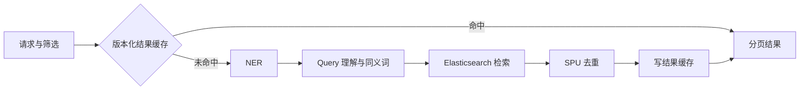

# 系统架构

## 分层与模块

| 模块 | 职责 | 依赖边界 |
| --- | --- | --- |
| `ai-search-fccapi` | 搜索、调试接口及入参出参 | 不依赖项目内模块 |
| `ai-search-feign` | 外部服务调用占位 | 本期不承载业务 |
| `ai-search-server` | 配置、DAO、NER、Query 理解和搜索编排 | 不依赖 rest |
| `ai-search-rest` | 启动、接口实现、异常处理和对象转换 | 调用 server |
| `ai-search-scheduled` | 定时任务占位 | 本期无任务 |

生产调用方向只有 `rest → server.service → server.dao → Elasticsearch/Redis`。DAO 不反向
依赖 service；server 不使用 HTTP 层的控制器或响应对象。前端独立部署，模型训练只在
`model-training/product-ner` 离线执行，在线 Java 进程直接加载 ONNX 制品。

## 搜索链路



NER 提取品牌、品类和属性等实体；Query 理解完成轻量改写及同义词扩展。ES 执行全文、
实体字段、筛选、排序和聚合查询。同一 `spuId` 的 SKU 最终只保留得分最高的一项并维持
原顺序；分页响应同时给出 ES 原始命中数和去重后的结果数。

热搜词由资源词表预热，每词缓存最多 200 条，命中后由服务按页切片。调试接口调用同一个
搜索服务，ES DSL 和条件描述由 DAO 在真实查询构建时返回，不另行模拟。

## NER 模式与降级

| 模式 | 行为 |
| --- | --- |
| `dictionary` | 只运行 Aho-Corasick 词典识别 |
| `model` | 运行 RaNER ONNX；模型未就绪或推理异常时回退词典 |
| `hybrid` | 默认；模型优先，词典补充不重叠实体 |

RaNER 的 emission 在 ONNX 中计算，CRF 维特比解码在 Java 中完成；标签映射后再进行
别名、业务 ID 和单位归一化。归一化新增标准字段，不覆盖原文及字符偏移。若整个 NER
组件异常，搜索以空实体继续全文检索，并记录 `NER_UNAVAILABLE`。

离线目录中两份 Label Studio 配置与在线后端标签集目前仍不一致；在线查询以
RaNER 映射到后端的标签为准。标签统一涉及既有标注数据，未经标注团队确认不得修改。

## 品类配件排除

排除词只由 `SearchExclusionConfig.buildExclusionTerms(category)` 生成，并作为标题
`must_not match_phrase` 条件进入真实 ES 查询。

- 通用后缀：识别“手机”后组合出“手机壳”“手机膜”等配件词。
- 品类特化：对“手机”额外排除“手机包”“手机绳”等有歧义的组合。
- 同义词扩展排除项；“手机壳”这类完整配件品类不再继续拼后缀。

通用后缀只对已在 `category-specific-exclusions.txt` 登记的品类启用，未登记的品类不做
后缀展开，避免生成“台灯壳”这类无意义条件。要让某个品类享受排除，先在该文件登记它。

### 排除短语必须与索引侧分词器对齐

`must_not match_phrase` 显式指定 `ai-search.search.exclusion-analyzer`（默认
`ik_max_word`），**不能沿用查询默认分词器**。

`products_v2` 的 `title` 使用 `analyzer: ik_max_word` 索引、`search_analyzer: ik_smart`
查询，两者对同一个词切分不同：

| 分词器 | “手机壳” |
| --- | --- |
| `ik_max_word`（索引侧） | `[手机, 机壳]` |
| `ik_smart`（默认查询侧） | `[手, 机壳]` |

`match_phrase` 要求词元位置连续对齐，切法不一致就漏匹配。在 109 万条真实商品上实测：
用默认分词器命中 4379 条，显式用 `ik_max_word` 命中 7229 条，**漏排约 39%**。

排除是硬过滤，宁可与索引侧严格对齐。若索引 mapping 的 `title` 分词器不同，用
`SEARCH_EXCLUSION_ANALYZER` 覆盖，使其与索引侧一致。

## 版本化缓存

结果 key 为：

```text
search:result:{indexVer}:{dictVer}:{nerModelVer}:{ruleVer}:{queryHash}:{filterHash}:{page}
```

查询和筛选条件分别取 SHA-256 的前 16 位十六进制。筛选哈希按 key 排序，维度包含
`brands`、`categories`、`minPriceFen`、`maxPriceFen`、`inStock`、`sort` 和
`pageSize`，避免不同排序或页大小串缓存。

普通结果 TTL 为 120 秒并增加 0–30 秒抖动，热搜 TTL 为 120 秒并在命中时续期，NER
结果 TTL 为 3600 秒。索引、词典、NER 模型或规则版本变化会生成新 key，旧数据等待
TTL 自然失效，无需全量删除。

真实数据下缓存收益明显：同一查询首次约 840 ms，二次命中约 37 ms。

### Redis 不可用是怎么判定的

DAO 层按约定吞掉所有 Redis 异常并返回 `null`，这样缓存故障不会拖垮搜索。代价是
**读操作无法区分“未命中”和“Redis 挂了”** —— 两者都返回 `null`。

因此判定点放在写入：`SearchCacheDao.putSearchResult` 返回 `boolean`，写失败即认定
Redis 不可用并标记 `REDIS_UNAVAILABLE`。缓存未命中时本来就要回写一次，这是零额外
开销的探测点。

不要改回“读操作抛异常让上层 catch”——那会让缓存故障有机会中断搜索，与 DAO 层
“永不抛出”的约定冲突。

## 降级矩阵

| 故障 | 行为 | 对外标记 |
| --- | --- | --- |
| Redis 不可用 | 跳过缓存，继续 NER 与 ES | `REDIS_UNAVAILABLE`，缓存状态 `UNAVAILABLE` |
| NER 模型不可用 | 回退词典 | provider 显示词典 |
| NER 整体异常 | 空实体继续全文搜索 | `NER_UNAVAILABLE` |
| SPU 去重异常 | 返回未去重结果 | `DEDUP_SKIPPED` |
| ES 不可用 | 已命中的缓存仍可返回；缓存未命中则失败 | HTTP 503、`SEARCH_UNAVAILABLE` |
