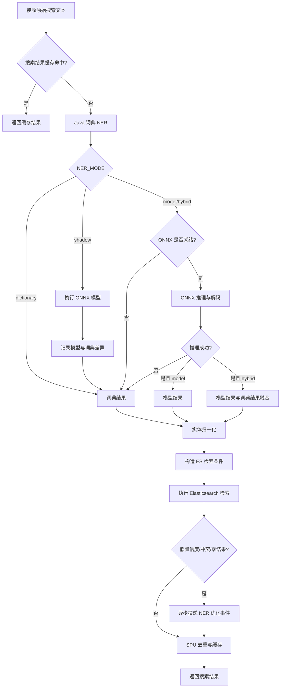
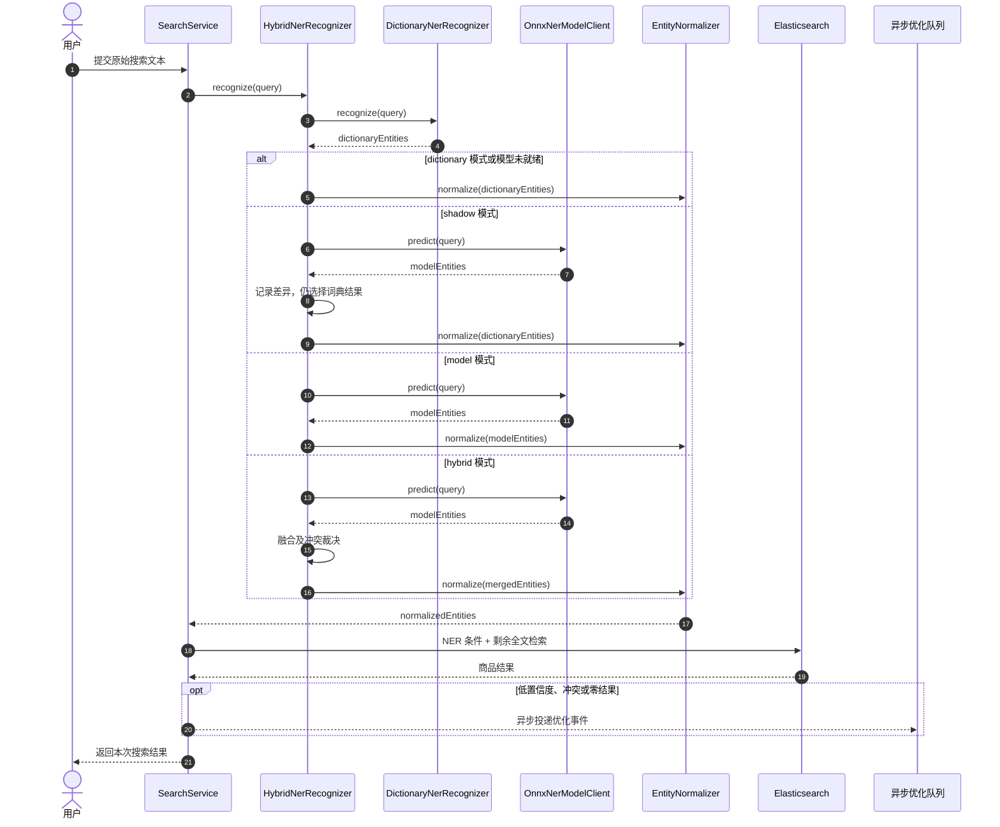
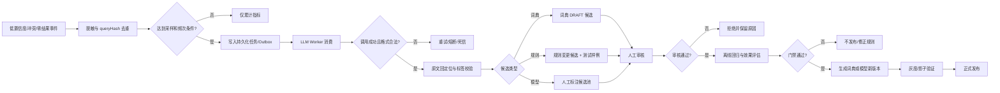
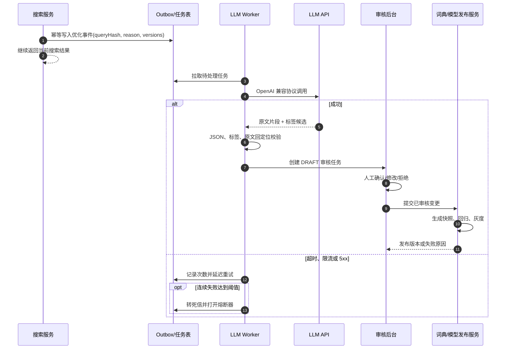
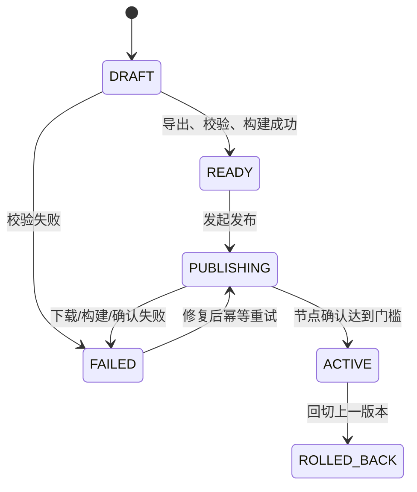

# 3. 功能详细设计

## 3.1 NER 词典和模型（谭松）

### 3.1.1 功能内容

#### 3.1.1.1 建设目标

NER（Named Entity Recognition，命名实体识别）用于从用户原始搜索文本中提取品牌、
品类、型号、规格和商品属性等结构化实体，并将实体映射为 Elasticsearch 可使用的检索条件。

本功能采用“确定性能力优先、模型补充长尾、LLM 异步闭环”的分层方案：

1. Java 词典 NER 负责高精度、低延迟识别和模型故障兜底；
2. Java ONNX 模型 NER 负责识别词典未覆盖的品牌、品类、型号和描述性实体；
3. LLM 仅异步分析低置信度、无结果和冲突样本，生成待审核候选，用于后续优化词典、
   规则和训练数据，不阻塞当前搜索请求，也不直接修改线上词典。

#### 3.1.1.2 输入与输出

输入为用户提交的原始搜索文本，例如：

```text
华为 Mate60 Pro 12G+512G 黑色手机
```

输出为实体列表。每个实体至少包含：

| 字段 | 说明 | 示例 |
| --- | --- | --- |
| `text` | 原始命中文本 | `华为` |
| `label` | 实体类型 | `BRAND` |
| `start` / `end` | 原始查询中的字符区间，左闭右开 | `0 / 2` |
| `source` | 识别来源 | `dictionary`、`onnx` |
| `confidence` | 模型置信度；词典结果可为空 | `0.96` |
| `normalizedText` | 归一化后的标准文本 | `华为` |
| `normalizedId` | 品牌、品类等业务主数据 ID | `brand-10001` |
| `normalizedType` | 标准化字段类型 | `brand_id` |
| `normalizationSource` | 归一化来源 | `dictionary`、`rule:power` |

实体的 `text/start/end` 始终指向原始搜索文本。归一化只能新增标准值，不能覆盖原文或改变
字符偏移，因为后续“删除已识别片段、保留剩余全文”的逻辑依赖原始偏移。

#### 3.1.1.3 实体范围

目标标签集共 16 类：

| 分工 | 实体类型 | 主要实现方式 |
| --- | --- | --- |
| 模型主识别 | `BRAND`、`CATEGORY`、`MODEL`、`SCENE`、`FUNCTION`、`MODIFIER` | ONNX 模型，词典补充 |
| 数值规则 | `CAPACITY`、`SIZE`、`WEIGHT`、`SPEC`、`PACKAGE_COMBINATION` | 数字、单位和组合规则 |
| 枚举词典 | `COLOR`、`MATERIAL`、`FLAVOR`、`APPEARANCE`、`AUDIENCE` | 业务词典 |

`BRAND`、`CATEGORY`、`MODEL` 是上线验收的核心标签。其他标签用于增强属性检索，但不得因
长尾标签识别失败而中断搜索。

#### 3.1.1.4 Java 词典 NER

Java 词典 NER 使用 Aho-Corasick 自动机完成多模式字符串匹配，适用于约十万级词条的低延迟
查询。词典包含两层：

- 基础词典：品牌、品类和常用属性等大规模词条；
- 覆盖词典：别名、系列、线上坏例修复和需要显式提权的词条。

词典文件格式为 TSV：

```text
实体词<TAB>实体类型<TAB>显式优先级
```

处理规则如下：

1. 同一归一化词只保留一条有效记录；
2. 候选按“显式优先级降序 → 标签优先级降序 → 词长降序 → 起点升序”裁决；
3. 纯 ASCII 词执行左右字母数字边界检查，避免 `pro` 错命中 `iPro`；
4. 已占用字符区间不再接受低优先级重叠实体；
5. 词典不可用时返回空词典结果，不影响全文搜索。

当前实现类为 `DictionaryNerRecognizer`，词典在应用启动时由文件加载并构建不可变 Trie。
数据库表 `search_ner_dict_entry` 作为可编辑词典源，审核通过后应导出不可变版本快照供
Java 加载；Java 不在每次搜索时查询数据库。

#### 3.1.1.5 Java ONNX 模型 NER

ONNX 模型在 Spring Boot 进程内通过 ONNX Runtime 执行，不部署 Python 在线推理服务。
主要步骤包括：

1. 使用与训练侧一致的 WordPiece 词表对原始查询分词；
2. 生成 `input_ids`、`attention_mask` 等模型输入；
3. 执行 ONNX 推理；
4. 对 logits 执行 softmax，或读取模型导出的标签序列；
5. 使用 BIO/BIOES 规则或 CRF Viterbi 解码实体；
6. 将 token 区间映射回原始字符区间；
7. 过滤低于置信度阈值的实体；
8. 映射为业务标签并进行实体归一化。

模型制品至少包括 ONNX 图、词表、标签映射、模型清单和一致性测试样例。模型发布前必须验证
Python 与 Java 的实体文本、标签和字符偏移完全一致。

#### 3.1.1.6 LLM 异步兜底与持续优化

LLM 不参加搜索请求的同步响应。以下样本可异步进入分析队列：

- 词典无命中且模型所有实体置信度均低于阈值；
- 词典与模型在相同字符区间给出不同标签；
- NER 识别出实体，但严格检索结果为 0；
- 相同零结果查询在统计窗口内达到频次阈值；
- 线上人工反馈为“品牌、品类或型号识别错误”；
- 新品牌、新品类或新型号导致的高频未登录词。

LLM 输出只作为 `DRAFT` 候选，必须经过格式校验、原文回定位、重复检查、人工审核和离线回归。
审核后的候选根据类型进入不同路径：

- 稳定别名、品牌、品类、枚举属性：进入词典候选；
- 数字单位或确定性模式：形成规则候选及回归测试；
- 依赖上下文的长尾实体：进入人工标注集，用于后续模型训练；
- 无法确认或冲突样本：保留在待仲裁队列，不进入线上。

LLM 产出的词条不得直接进入训练集，避免模型产物自举污染。只有经过人工确认并满足标注流程的
数据，才可以转为训练数据。

#### 3.1.1.7 运行模式

| 模式 | 行为 | 用途 |
| --- | --- | --- |
| `dictionary` | 只返回词典结果 | 模型未发布或紧急降级 |
| `shadow` | 同时执行词典和模型，线上仍返回词典结果 | 上线前观察模型差异 |
| `model` | 优先返回模型结果；模型不可用时回退词典 | 模型独立评估 |
| `hybrid` | 模型为主，词典补充不重叠实体 | 默认生产模式 |

无论配置为 `model` 还是 `hybrid`，ONNX 未就绪或推理异常时都自动回退词典。

---

### 3.1.2 实现逻辑

#### 3.1.2.1 组件划分

| 组件 | 职责 | 当前实现 |
| --- | --- | --- |
| `SearchService` | 搜索主流程编排和最终降级 | 已实现 |
| `NerRecognizer` | NER 统一接口 | 已实现 |
| `HybridNerRecognizer` | 模式选择、模型与词典融合、模型异常回退 | 已实现 |
| `DictionaryNerRecognizer` | 加载词典、构建 Trie、匹配及词典内部冲突裁决 | 已实现 |
| `OnnxNerModelClient` | 加载 ONNX 制品、推理、解码和置信度过滤 | 已实现 |
| `BertWordPieceTokenizer` | Java 侧 WordPiece 分词和字符 offset 映射 | 已实现 |
| `CrfViterbiDecoder` | Java 侧 CRF 解码 | 已实现 |
| `RaNerLabelMapper` | 模型标签到业务标签映射 | 已实现 |
| `EntityNormalizer` | 别名、业务 ID 和确定性单位归一化 | 已实现 |
| `NerFieldMapping` | NER 标签到 ES 字段及权重映射 | 已实现 |
| 词典管理及发布服务 | 审核、生成快照、版本切换、回滚 | 待实现 |
| NER 异步样本采集器 | 采集低置信度、冲突和零结果样本 | 待实现 |
| LLM 分析 Worker | 限流调用 LLM、校验结果、生成审核任务 | 离线工具已实现，在线异步 Worker 待实现 |

#### 3.1.2.2 在线业务流程



异步事件投递失败不能影响步骤 `P/Q`。当前请求始终使用已经完成的词典、模型和全文检索结果。

#### 3.1.2.3 在线识别时序



#### 3.1.2.4 模型加载逻辑

应用启动时执行以下检查：

1. `NER_MODEL_ENABLED=false` 时不加载模型，状态记为 `disabled by configuration`；
2. 校验模型、词表、标签和解码配置文件是否完整；
3. 初始化 WordPiece tokenizer；
4. 加载并校验标签数及 CRF 转移矩阵；
5. 创建 ONNX Runtime Session；
6. 校验输入、输出名称及张量类型；
7. 使用固定 fixture 执行一次预热和结果校验；
8. 全部成功后才将模型状态设置为 Ready。

加载过程采用“先完整构造、验证通过后再发布引用”的原则。任何一步失败都不能替换当前可用模型。
进程首次启动且没有可用模型时，保持词典模式。

#### 3.1.2.5 模型推理与置信度处理

非 CRF 模型按 token 最大 softmax 概率计算置信度，实体置信度取组成 token 的平均值。低于
`confidenceThreshold` 的实体不进入在线结果。CRF 模型没有可直接比较的 token softmax 时，
应以训练/导出清单规定的解码策略为准，不能擅自复用非 CRF 阈值。

若模型成功执行但过滤后实体列表为空：

1. `hybrid` 模式继续使用词典实体；
2. `model` 模式当前实现返回模型空结果；目标方案应配置
   `model-empty-fallback-to-dictionary=true`，避免有明确词典命中的查询退化；
3. 记录 `all_entities_below_threshold` 指标；
4. 满足采样规则时异步提交给 LLM 分析，不同步等待 LLM。

#### 3.1.2.6 模型与词典融合

`hybrid` 模式以模型结果为主：

1. 先加入模型实体；
2. 对每个词典实体查找已有重叠实体；
3. 无重叠时补入词典实体；
4. 完整词典品类覆盖模型切碎的品类时，用完整 `CATEGORY` 替换碎片；
5. 词典品类不能覆盖 `BRAND`、`MODEL` 等强身份实体；
6. 最终结果按 `start` 升序返回；
7. 归一化只增加标准字段，不改变原始跨度。

目标裁决优先级必须由统一配置生成并在 Python、Java、Label Studio 和数据库约束间保持一致。
同一跨度不同标签仍无法裁决时，采取保守策略：

- 不生成硬过滤条件；
- 将原始片段保留在全文搜索中；
- 记录冲突详情并异步送审；
- 不允许 LLM 在当前请求中覆盖 Java 结果。

#### 3.1.2.7 NER 结果在检索中的使用

NER 结果由 `NerFieldMapping` 转换为 Elasticsearch 字段和权重。品牌、品类等核心实体可以
形成强约束，其他实体形成属性或标签增强条件。已经识别的字符片段从原始查询中裁剪，剩余文本
继续对标题执行全文检索。

如果整个 NER 组件异常，`SearchService` 将实体置为空并继续全文搜索，降级原因记为
`NER_UNAVAILABLE`。NER 故障本身不应向用户返回 5xx；只有 Elasticsearch 不可用且没有可用
缓存时，搜索接口才返回服务不可用。

#### 3.1.2.8 LLM 异步优化闭环



LLM 异步调用序列如下：



#### 3.1.2.9 词典版本发布与切换

词典以不可变快照发布，禁止直接修改正在被 Java 使用的文件。建议版本标识包含生成时间和内容
哈希，例如：

```text
dict-20260728-153000-a13f5c9e
```

发布流程：

1. 从 `search_ner_dict_entry` 导出 `APPROVED` 且属于运行范围的记录；
2. 校验唯一词、标签枚举、字符长度、优先级和业务 ID；
3. 生成临时快照并计算 SHA-256；
4. 在隔离对象中构建 Trie，执行固定回归样例和性能检查；
5. 将快照登记为 `READY`；
6. 节点下载并校验哈希，在内存中构建新 Trie；
7. 使用单次原子引用替换切换新版本；
8. 上报节点切换确认；达到发布策略要求后将版本标记为 `ACTIVE`；
9. 保留当前版和至少两个历史版本，以便快速回滚。

版本号必须进入搜索结果缓存 key。词典或模型切换后使用新版本 key，旧缓存依靠 TTL 自然失效，
不能复用旧版本识别结果。

#### 3.1.2.10 可观测性

至少记录以下指标：

| 指标 | 说明 |
| --- | --- |
| `ner_requests_total{mode,provider}` | 各运行模式和实际提供方请求数 |
| `ner_latency_ms{provider}` | 词典、ONNX、融合耗时 |
| `ner_model_ready` | ONNX 是否可用 |
| `ner_model_fallback_total{reason}` | 模型回退词典次数 |
| `ner_empty_result_total` | NER 无实体次数 |
| `ner_all_below_threshold_total` | 模型实体全部低于阈值次数 |
| `ner_conflict_total{labels}` | 模型和词典冲突次数 |
| `ner_zero_hit_total` | 有 NER 条件但 ES 零结果次数 |
| `ner_dict_version` / `ner_model_version` | 当前生效版本 |
| `ner_llm_queue_depth` | LLM 异步任务积压 |
| `ner_llm_failure_total{reason}` | LLM 超时、限流、解析失败等 |
| `ner_llm_circuit_state` | LLM 熔断状态 |

日志中保留 `traceId`、查询哈希、命中实体、provider、词典版本、模型版本和降级原因。原始查询若
可能包含敏感信息，应按安全规范脱敏或只记录哈希。

---

### 3.1.3 异常处置

#### 3.1.3.1 处置原则

1. **搜索可用性优先**：词典、模型和 LLM 故障不能阻塞全文搜索；
2. **同步链路不调用 LLM**：LLM 超时、限流和供应商故障与当前用户请求隔离；
3. **版本化而非原地覆盖**：词典和模型发布失败时保留上一可用版本；
4. **先校验后切换**：新对象完全加载并通过自检后，才替换线上引用；
5. **自动候选不直接生效**：LLM、模型回流结果必须经过人工审核和离线回归；
6. **可重试操作必须幂等**：使用 `eventId/queryHash + sourceVersion` 防止重复创建候选；
7. **补偿采用状态反冲**：发布失败不删除审计记录，而是将任务或版本反冲为失败/回滚状态，
   记录原因并允许人工重试。

#### 3.1.3.2 异常处置矩阵

| 异常场景 | 检测方式 | 当前请求处理 | 后续处置与补偿 | 告警建议 |
| --- | --- | --- | --- | --- |
| ONNX 模型加载失败 | 文件缺失、哈希不一致、Session 创建失败、标签数不一致、fixture 失败 | 模型保持 Not Ready，使用词典 | 不替换旧模型；首次部署则保持 `dictionary`；记录 `unavailableReason`，修复制品后重新预加载 | 启动立即告警；生产模型连续 5 分钟 Not Ready 升级告警 |
| ONNX 推理异常 | RuntimeException、张量类型或输出名不匹配、native 内存异常 | `HybridNerRecognizer` 捕获异常并回退词典 | 统计失败率；短时异常重建 Session；超过阈值将模式切为词典并停止模型探测一段时间 | 5 分钟失败率超过 1% 告警 |
| 词典不可用 | 文件不存在、读取失败、词条数为 0、Trie 自检失败 | 若模型可用则使用模型；模型也不可用则空实体全文搜索 | 不发布空词典；保留上一内存 Trie；首次启动无旧版时标记 `NER_UNAVAILABLE` | 立即告警，词条数相对上一版骤降也告警 |
| 词典版本切换失败 | 下载失败、哈希不一致、构建 Trie 失败、节点确认超时 | 节点继续使用旧词典版本 | 将新版本从 `PUBLISHING` 反冲为 `FAILED`；活动版本指针保持不变；已切换节点按发布策略回滚旧快照，或保持双版本并禁止宣布全局 Active | 发布任务告警并附失败节点列表 |
| NER 结果置信度全低于阈值 | 模型原始候选非空、过滤后为空 | `hybrid` 使用词典；无词典实体时保留完整原文全文搜索 | 记录样本并按频次异步送 LLM；不得临时降低全局阈值 | 比例较基线显著升高时告警 |
| LLM 超时、429 或 5xx | 请求超时、HTTP 状态码、连接失败 | 不影响当前搜索 | 指数退避重试并加入随机抖动；达到阈值打开熔断器；任务保留在队列或进入死信，恢复后重放 | 按供应商、模型分别告警 |
| LLM 返回非法 JSON 或改写原文 | JSON 解析失败、标签越界、原文片段无法回定位 | 不影响当前搜索 | 标记 `INVALID_RESULT`，有限次数重试；持续失败暂停该 prompt/model 版本，不生成词典候选 | `relocate_miss_rate` 或解析失败率超过门槛立即告警 |
| 实体冲突无法裁决 | 同一/重叠区间出现不同标签且优先级无法唯一决定 | 不生成冲突实体的硬过滤条件，冲突片段留在全文查询 | 保存双方实体、版本和上下文，进入人工仲裁；仲裁结论形成覆盖词典、规则测试或训练样本 | 高频冲突或 BRAND/CATEGORY/MODEL 冲突立即告警 |
| 实体 offset 非法 | `start < 0`、`end > query.length`、`substring != text` | 丢弃非法实体；其他合法实体继续使用 | 记录模型版本和样本；达到阈值自动禁用该模型版本并回退词典 | 任一线上 offset 错误均应告警 |
| 标签无 ES 字段映射 | `NerFieldMapping` 查不到目标字段 | 不生成该实体的 ES 结构化条件，原文仍参与全文搜索 | 记录配置错误；新增标签必须同步 Java 映射、优先级、SQL 约束及训练配置 | 发布前门禁阻断，线上出现立即告警 |
| 实体归一化词典不可用 | 文件缺失、解析失败、加载后条数为 0 | 返回未归一化实体，使用原始 `text` 检索 | 保留上一归一化词典；修复后重新加载，不改 `text/start/end` | 告警但不阻断搜索 |
| 异步事件投递失败 | Outbox 写入失败或消息队列不可用 | 当前搜索正常返回 | 优先采用本地事务 Outbox；后台补发；超过保留期转人工导出，不在请求线程同步重试 LLM | 队列不可用、积压或最老任务延迟告警 |
| 审核通过后发布调用失败 | 发布服务、存储或节点接口失败 | 不影响搜索，旧版本继续生效 | 审核记录保持 `APPROVED`，发布单从 `PUBLISHING` 反冲为 `PUBLISH_FAILED`；记录目标版本和失败步骤，支持幂等重试 | 发布失败立即告警 |

#### 3.1.3.3 ONNX 模型加载失败

模型加载采用双实例/先加载后切换方式。新模型失败时不得调用 `closeSession()` 关闭当前正在服务的
旧模型。目标状态机如下：

```text
UPLOADED → VALIDATING → READY → CANARY → ACTIVE
                    ↘ FAILED
ACTIVE → ROLLED_BACK
```

处理步骤：

1. 记录制品目录、模型版本、哈希、异常类型和 `unavailableReason`；
2. 若存在旧模型，保持旧模型继续服务；
3. 若不存在旧模型，`model.isReady()` 返回 false，由融合层自动使用词典；
4. 健康检查标记模型子组件为 degraded，但应用整体仍可提供搜索；
5. 修复制品后重新进入 `VALIDATING`，不能在失败对象上原地补文件后直接设为 Ready；
6. 多节点发布中任一节点未通过 fixture，不得宣布版本全量生效。

#### 3.1.3.4 词典版本切换失败与反冲

词典切换不是数据库事务，不能通过删除已审核词条“回滚”。补偿对象应是发布版本和活动指针：



具体补偿：

1. `active_version` 只有在发布门槛满足后才原子更新；
2. 切换失败时将发布单置为 `FAILED`，活动指针保持旧值；
3. 如果部分节点已经切换，发布控制器向这些节点发送旧版本回切指令；
4. 回切失败的节点从负载均衡摘除，避免同一集群长期混用词典版本；
5. 已审核的词条仍保留 `APPROVED`，下次重新生成快照，不反向删除业务审核结果；
6. 缓存 key 使用节点实际生效版本，避免新旧节点串用缓存。

#### 3.1.3.5 置信度全低于阈值

该场景不等价于模型故障。处理方式：

1. 保留词典结果；
2. 未命中词典时，将完整原始查询交给全文搜索；
3. 不在单次请求内动态降低阈值，避免低质量实体形成错误硬过滤；
4. 记录模型原始最高置信度、模型版本、词典版本、ES 结果数；
5. 对高频样本异步送 LLM 和人工复核；
6. 若整体比例突然升高，优先检查模型版本、词表、预处理和阈值配置是否与
   `ner_manifest.json` 一致，而不是直接补词典。

#### 3.1.3.6 LLM 超时与熔断

LLM Worker 建议采用以下策略：

- 单次请求设置连接和读取超时；
- 对超时、429 和 5xx 最多重试 3 次，使用指数退避和随机抖动；
- 4xx 参数错误、鉴权失败和非法模型名不自动重试；
- 连续失败次数或时间窗口失败率超过阈值时打开熔断器；
- 熔断期间不调用供应商，任务延迟留存；
- 半开状态只放行少量探测任务，成功后恢复；
- 超过最大重试次数进入死信队列，保留 prompt、模型版本、请求摘要和失败原因；
- API Key 只能通过环境变量或密钥管理服务注入，日志中禁止输出。

LLM 服务恢复后按任务幂等键重放，不得重复创建词典候选和审核单。

#### 3.1.3.7 实体冲突无法裁决

无法裁决的冲突不得“随机选一个”。处理顺序：

1. 先应用显式优先级、标签优先级、跨度长度和来源优先级；
2. 完整词典 `CATEGORY` 可以修复模型切碎的品类，但不能覆盖品牌和型号；
3. 仍冲突时，将冲突跨度从结构化硬约束中移除；
4. 原始字符保留在全文搜索条件中，保证基础召回；
5. 记录词典实体、模型实体、置信度、版本和最终处置；
6. 高频冲突生成审核任务；
7. 审核结论必须沉淀为可重复验证的覆盖词典、规则测试或人工训练样本。

#### 3.1.3.8 发布调用失败的通用补偿

类似“审批后调用 Feign 接口失败”的情况，应将业务审批和外部发布拆成两个可追踪状态，不能因为
外部调用失败而撤销审批事实：

```text
审核状态：DRAFT → APPROVED / REJECTED
发布状态：NOT_PUBLISHED → PUBLISHING → PUBLISHED / PUBLISH_FAILED
```

外部调用失败时：

1. 审核状态保持 `APPROVED`；
2. 发布状态更新为 `PUBLISH_FAILED`，保存失败码、失败步骤和最后重试时间；
3. 通过 Outbox 或任务表异步重试，使用 `releaseId + targetVersion` 作为幂等键；
4. 外部接口返回成功后，必须反查目标版本或校验内容哈希，再标记 `PUBLISHED`；
5. 超过最大自动重试次数转人工处理；
6. 如果外部系统已生效但本地超时未知，先查询远端状态，禁止直接重复创建新版本；
7. 确认发布了错误内容时，创建“回滚到上一版本”的新操作记录，不修改或删除历史发布记录。

---

### 3.1.4 版本、缓存与数据安全

1. 搜索结果缓存 key 包含索引、词典、NER 模型和规则版本；
2. 版本变化后生成新 key，旧缓存按 TTL 自然失效；
3. 词典快照、模型 bundle、配置和评测报告均计算 SHA-256；
4. 训练数据必须保留来源和数据版本，LLM 银标不得进入冻结测试集；
5. 冻结测试集必须由人工双标和仲裁产生；
6. 原始搜索日志进入训练或 LLM 前必须脱敏；
7. LLM 返回内容不得直接执行、不得直接生成线上 SQL，也不得绕过审核修改词典。

### 3.1.5 验收标准

| 项目 | 验收要求 |
| --- | --- |
| 在线可用性 | ONNX 不可用时自动回退词典；NER 整体异常时仍可全文搜索 |
| 模型一致性 | Python 与 Java 的实体 `text/start/end/label` 差异为 0 |
| 词典切换 | 新版加载失败不影响旧版；支持明确版本回滚 |
| 核心效果 | 冻结测试集 micro-F1 ≥ 0.92，BRAND F1 ≥ 0.95，CATEGORY F1 ≥ 0.93 |
| 长尾价值 | 未登录品牌召回率 ≥ 0.70 |
| 性能 | Java ONNX CPU 单条推理 p99 ≤ 30 ms |
| 边界质量 | offset 全部合法，边界错误占比 ≤ 5% |
| LLM 隔离 | LLM 超时或熔断不增加同步搜索延迟，不影响搜索成功率 |
| 自动回流安全 | 未审核 LLM/NER 候选进入线上词典或冻结测试集的数量为 0 |

### 3.1.6 当前实现与目标设计差异

本节用于防止将规划能力误认为已经上线：

1. Java 当前从静态文件加载基础词典和覆盖词典，尚未实现数据库词典快照的在线热切换；
2. `search_ner_dict_entry` 已有建表脚本，但文中提到的版本表、发布控制器、节点确认和回滚流程
   尚需实现；
3. LLM 当前用于离线银标，在线低置信度事件采集、队列、Worker、审核后台和熔断尚需实现；
4. NER Redis DAO 已提供版本化 key 和读写接口，但当前搜索主流程尚未接入独立 NER 结果缓存；
5. 训练侧新 ONNX bundle 与 Java 当前期待的 `config.json/crf.json` 契约存在差异，发布前必须
   统一 `labels.json`、CRF 文件名、输出名称、阈值和 `max_length`；
6. 训练侧 16 标签及优先级尚需与 `NerFieldMapping`、Java 词典优先级和数据库 CHECK 约束
   完整同步；
7. Java 预处理与训练侧等长归一化仍需通过 `NerParityTest` 验证，未通过前模型只能处于
   `shadow` 或禁用状态。

