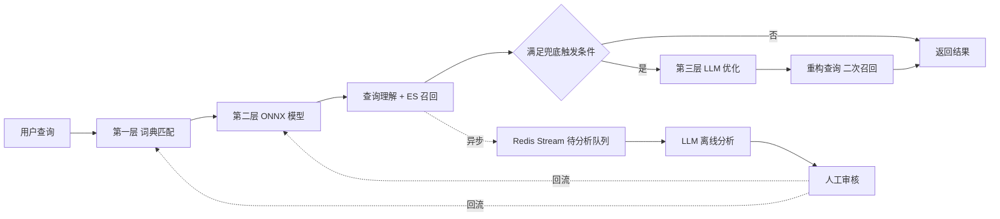

# Vemall AI Search 搜索链路技术方案

| 项目 | Vemall AI Search — 商城智能搜索 |
|---|---|
| 范围 | NER 实体识别 + LLM 兜底与离线增强 |
| 编写 | 谭松（NER 部分）、许盛君（LLM 部分） |
| 版本 | v1.0 |
| 日期 | 2026-07-26 |
| 状态 | 待评审 |

---

## 一、方案概述

### 1.1 要解决的问题

当前搜索链路依赖词典匹配识别实体，再交由 Elasticsearch 召回。该方案在标准查询上
表现良好，但存在两类结构性缺陷：

一是**未登录词无法识别**。词典基于精确匹配，新上架品牌、品牌别名、用户错拼、
中英混写一律漏识别，导致本可命中的商品无法通过品牌或类目筛选。

二是**模糊与非标查询无法处理**。用户以口语化、场景化方式表达需求时，
查询中往往不含任何可匹配的实体词，最终表现为零结果或低质量结果。

### 1.2 分层漏斗架构

方案采用由快到慢、由低成本到高智能的三层漏斗结构，逐层兜底。优先保障检索性能，
仅在下层能力不足时触发上层能力。

| 层级 | 组件 | 实现 | 典型耗时 | 成本 | 覆盖场景 |
|---|---|---|---|---|---|
| 第一层 | DictionaryNER | Aho-Corasick 精确匹配 | 毫秒级 | 零 | 标准、高频查询 |
| 第二层 | OnnxNER | BERT + ONNX Runtime 进程内推理 | 几十毫秒 | 低 | 常规及轻微非标查询，覆盖未登录词 |
| 第三层 | LLM 在线兜底 | 外部大模型 API | 数百毫秒至数秒 | 按调用计费 | 复杂、模糊、非标查询 |



设计原则：**低速高智的 LLM 不替代高速低成本的传统链路，仅作兜底与迭代增强。**

### 1.3 LLM 的两个角色

- **在线兜底（同步）**：NER 识别效果差或 ES 召回不足时实时触发，优化当前查询。
- **离线增强（异步）**：对低置信度、零实体、高频重复查询做深度分析，
  经人工审核后反哺词典与模型，形成长期迭代闭环。

### 1.4 量化目标

| 维度 | 指标 | 目标 |
|---|---|---|
| 实体识别 | 实体级 micro-F1 | ≥ 0.92 |
| 实体识别 | 未登录品牌召回 | ≥ 0.70 |
| 实体识别 | CPU 单条推理 p99 | ≤ 30ms |
| 搜索效果 | 零结果率 | 下降 50% 以上 |
| 搜索效果 | 整体召回率 | 提升 15%–20% |
| 成本 | LLM 月调用成本 | 基准场景下可控在数十元量级 |

---

## 二、第一、二层：实体识别（NER）

### 2.1 词典层现状

线上现有 96,234 条有效词条，构成如下：

| 标签 | 条目数 | 占比 |
|---|---:|---:|
| ATTRIBUTE | 61,505 | 63.9% |
| BRAND | 27,389 | 28.5% |
| CATEGORY | 7,310 | 7.6% |
| MODIFIER | 30 | 0.03% |

词典的价值在于快、准、零成本，方案中**永久保留作为兜底**，不因模型上线而移除。
其局限已在 1.1 说明：对未登录词召回为零。

本仓库 smoke 数据上的对比可以说明两种方案的能力差异形态：词典基线 micro-F1 0.923
但未登录品牌召回 0.000，模型 micro-F1 0.839 但未登录品牌召回 1.000。该组数据来自
随机初始化的微型模型与合成样例，仅用于说明差异形态，不代表真实性能预期，
真实数字需在第七章的冻结 test 集上重新测量。

需要强调的是，只看 micro-F1 会得出"不需要模型"的错误结论。未登录词召回才是模型
相对词典的核心价值。

### 2.2 模型层技术方案

采用 BERT 系编码器 + token classification 的标准序列标注方案，训练产物导出为 ONNX，
由 Java 进程内加载推理，不部署独立的 Python 推理服务。

| 项 | 取值 | 说明 |
|---|---|---|
| 标注方案 | BIO | BIOES 在小数据量下标签更稀疏，收益不稳定 |
| max_length | 64 | 商品标题 p99 约 31 字符，查询更短 |
| CRF | 首版关闭 | ONNX 导不出 Viterbi 解码，先建立无 CRF 基线 |
| 类别加权 | inv_sqrt，上限 10 | O 标签占约 70%，不加权模型会退化为全预测 O |
| 选优指标 | 实体级 micro-F1 | 不采用 loss 或 token 准确率 |

### 2.3 预训练模型选型

#### 2.3.1 一项容易被忽略的工程约束

后端的分词器为手写实现（`BertWordPieceTokenizer`），只读取 `vocab.txt`，
且只支持 WordPiece 算法。由此产生两条硬约束：

1. SentencePiece、BPE 系模型无法接入，包括 DeBERTa 系与多数多语言模型；
2. 更换词表不同的模型时，Java 侧需同步改动，跨语言一致性测试全部重跑。

而 HFL 系列的 `chinese-macbert-base`、`chinese-roberta-wwm-ext`、`rbt6`、`rbt3`
共用 `bert-base-chinese` 的同一份 21,128 词表（base 级模型继承官方中文 BERT-base
的词表与权重）。在该家族内部切换模型时，`vocab.txt` 不变，Java 侧无需改动，
一致性测试的 fixture 可直接复用。

因此选型的实质是**先选定词表家族，再在家族内按延迟预算挑参数量**。

#### 2.3.2 选型结论

| 角色 | 模型 | 参数量 | 许可证 | 说明 |
|---|---|---:|---|---|
| 主模型 | `hfl/chinese-macbert-base` | 约 102M | Apache-2.0 | 中文能力强，ONNX 导出无障碍，INT8 量化后 CPU 单条 3–8ms |
| 延迟兜底 | `hfl/rbt6` 或 `hfl/rbt3` | 约 60M / 38M | Apache-2.0 | 同词表，修改一行配置即可降级，Java 侧不动 |
| 预标注辅助 | 达摩院 RaNER 电商 NER | — | 需逐个确认 | 仅在独立环境运行，产出银标，不上线 |

延迟不达标时的应对是改配置降级，而非重做方案，这是选定同词表家族带来的直接收益。

#### 2.3.3 排除项

| 候选 | 排除理由 |
|---|---|
| MacBERT-large 等 large 系列 | 首批仅约 2,000 条标注，任务受限于数据量而非模型容量。约 324M 参数使 CPU 延迟增至 3 倍以上，而在扁平短实体任务上相对 base 的收益通常不足 1 个 F1 点 |
| ERNIE 3.0 | 词表与 bert-base-chinese 不同，更换需改动 Java 侧；HuggingFace 版本由社区自 PaddleNLP 转换，长期维护存在风险 |
| DeBERTa 系（含 Erlangshen） | 官方调用示例强制 `use_fast=False`，无法获取 `offset_mapping`。本方案的字符级 offset 契约据此直接否决 |
| gte-multilingual | 306M 参数、8192 上下文，对平均 14 字符的商品查询属于浪费，且需 `trust_remote_code` |
| ModernBERT | 预训练语料为英文与代码 |
| MiniRBT | 6 层、10–12M 参数，体积占优，但词表是否与 bert-base-chinese 一致需实测确认。若不一致则丧失"改配置降级"的性质，优先级低于 rbt3 |

#### 2.3.4 达摩院模型的定位

RaNER 电商 NER 输出直接带 span，实体类型与本项目标签体系高度重合，但不适合直接上线：
依赖 `modelscope` 与 `adaseq`，会将 torch、transformers 拉回旧版本与服务栈冲突；
标签体系固定，与 ES 字段对不齐，映射必然有损；工具箱为 Apache-2.0 不等同于权重许可。

其正确定位是**预标注辅助**，在独立环境运行后映射到本项目标签，生成标注任务，
显著降低首批标注成本，产出仍需人工修正方可作为金标。

### 2.4 训练数据来源

#### 2.4.1 自有数据

商品库导出约 109 万条商品标题及结构化 brand/category 字段，线上词典 96,234 条。
真实线上搜索 query 日志目前尚未获取，该项对效果影响显著：用户搜"华为 256g"
而非完整商品标题，仅用商品标题训练会使模型在真实短查询上表现明显下降。
建议列为需协调获取的输入。

#### 2.4.2 开源数据集调研

| 数据集 | 内容 | 与本项目标签的对应 | 用途 |
|---|---|---|---|
| E-commerce (Jie et al. 2019) | 中文商品标题 NER，BIO 格式，约 4–6k 句 | HPPX→BRAND，HCCX→CATEGORY，XH→MODEL，MISC→部分属性 | 中间训练、冷启动迁移 |
| MEPAVE（京东） | 34K 商品、87K 属性值标注 | 对应属性类标签 | 补充属性类样本 |
| CLUENER2020 | 新浪新闻，10 类细粒度 | 领域不匹配 | 中文 NER 预热 |
| ttxy/cn_ner | 22 个中文 NER 数据集合集，统一 BIO | 混合 | 取数入口 |
| MEP-3M | 中文电商多模态，599 子类 | 分类任务而非 NER | 类目体系参考 |

其中 E-commerce (Jie et al. 2019) 匹配度最高，其标签语义与本项目的 BRAND、
CATEGORY、MODEL 基本一一对应，可用于中间训练——先在开源数据上微调，再用自有金标
继续微调，以降低冷启动所需的标注量。

来源链接：
[E-commerce 数据集](https://github.com/allanj/ner_incomplete_annotation/tree/master/data/ecommerce) ·
[对应论文](https://aclanthology.org/N19-1079/) ·
[CLUENER2020](https://github.com/CLUEbenchmark/CLUENER2020) ·
[ttxy/cn_ner](https://huggingface.co/datasets/ttxy/cn_ner) ·
[MEP-3M](https://github.com/ChenDelong1999/MEP-3M) ·
[awesome-chinese-ner 索引](https://github.com/taishan1994/awesome-chinese-ner)

#### 2.4.3 使用限制

1. **商用授权需确认**。上表多为研究用途数据集，多数未明确商用授权条款。
   该事项与会议风险点"技术选型是否和公司适配"性质相同，建议一并提交确认。
   在授权明确前，开源数据仅用于本地实验，不进入正式训练产物。
2. **不得进入 test 集**。验收 test 必须全部来自自有双标加仲裁的金标数据，
   否则评估的是他方标注口径而非本业务口径。
3. **标签映射有损**。开源标签与本项目 ES 字段并非一一对齐，映射必然丢失信息，
   只能作为预训练信号，不能作为真值。

### 2.5 冷启动与标注方案

#### 2.5.1 三层预标注

人工从零标注 2,000 条商品标题约需 15–20 小时。三层预标注叠加后可降至 3–5 小时
（单条修正约 5–10 秒），这是控制标注成本的主要手段。

| 层 | 手段 | 覆盖范围 |
|---|---|---|
| 一 | 线上词典弱标注 | 已知品牌与品类，无未登录词 |
| 二 | RaNER 电商模型预标注 | 词典未登录的品牌、型号 |
| 三 | 开源电商数据集中间训练 | 商品标题的实体分布先验 |

三层产出一律为银标，必须人工逐条修正后方可升为金标。规则、模型或大模型的输出
在任何情况下都不能直接作为金标。

#### 2.5.2 数据分层与防泄漏

数据按 raw、silver、gold、processed 四层管理。两条不可妥协的规则：

1. test 集只能来自金标，且必须双人标注加仲裁；
2. **按组切分而非按行切分**。商品库中约 40% 为模板近重复（如"插座3米""插座5米"），
   按行切分会使近重复样本跨越 train 与 test，F1 虚高数个点。方案采用 MinHash 加 LSH
   对字符 4-gram 聚类后整组划分，切分报告中的泄漏组数必须为零。

#### 2.5.3 标注组织

首批 2,000 条，由 8 人团队分摊，20% 任务双标用于计算一致性。校准阶段先由全员标注
同一批 100 条，两两 strict span F1 低于 0.90 时先修订规范再扩大产量。
冲突样本由产品负责人仲裁后方可合并。

---

## 三、第三层：LLM 在线兜底

### 3.1 触发条件

通过可配置、分优先级的规则控制调用时机，避免无效调用。

| 触发场景 | 判定条件 | 配置属性 | 优先级 |
|---|---|---|---|
| 零结果触发 | ES 召回结果总数 = 0 | 固定条件 | P0（最高） |
| 低结果触发 | ES 召回结果总数 < 3 | 可动态配置 | P1 |
| 低置信度触发 | NER 实体数为 0，或实体平均置信度低于阈值 | 可动态配置 | P2 |
| 复杂查询触发 | 查询长度 > 15 且 NER 实体数 < 2 | 可动态配置 | P3 |

置信度阈值取值见第十章"待对齐事项"第 1 条。

### 3.2 执行流程

1. 查询依次经过 DictionaryNER、OnnxNER 完成实体识别与合并；
2. 基于识别结果完成查询理解，构建初始 ES 查询并执行召回；
3. 匹配兜底触发条件，不满足则直接返回初始结果；
4. 满足则调用 LLM，执行查询纠偏、语义扩展、意图补全；
5. 基于优化结果重构 ES 查询，完成二次召回并返回最终结果。

### 3.3 职责边界

严格限定 LLM 能力边界，聚焦查询优化，规避不可控推理与业务耦合。

**承担**：分词纠偏（修正错别字、优化分词）、语义扩展（同义词、上下位词、相关词）、
意图补全（识别意图并配置 ES 字段权重与过滤条件）。

**禁止**：直接生成或返回商品列表；执行复杂业务推理与结果排序；
向大模型侧留存用户查询与交互历史。

### 3.4 Prompt 设计

采用固定结构化 Prompt，约束输出格式，保障结果可机器解析。

System Prompt 设定角色为电商搜索语义理解专家，明确分词纠偏、语义扩展、意图分类、
权重推荐、过滤推荐五项任务，强制纯 JSON 输出。

User Prompt 传入原始查询、NER 识别结果、ES 分词结果、当前召回结果数四项参数，
固定返回包含修正查询、语义扩展词、分词列表、意图标签、字段权重、过滤条件、
二次召回标识七个字段的 JSON。

所有返回结果在使用前必须做合法性校验，字段缺失或格式不符时按 3.5 降级处理。

### 3.5 降级与容错

- LLM 超时或调用失败时，直接返回首次 ES 召回结果，不中断检索链路；
- 完整记录异常日志用于排查；
- 支持熔断，连续多次失败后临时暂停调用，降低服务压力与成本。

---

## 四、离线增强与闭环迭代

### 4.1 异步触发条件

针对低质量、难识别、高复用查询异步触发深度分析，不影响线上检索性能。

| 触发场景 | 判定条件 | 配置参数 |
|---|---|---|
| 零实体触发 | NER 识别实体数量为 0 | `llm.async.trigger.zeroEntity` |
| 低置信度触发 | 所有 NER 实体置信度均低于阈值 | `llm.async.trigger.lowConfidenceThreshold` |
| 重复查询触发 | 24 小时内相同查询出现 ≥ 5 次 | `llm.async.trigger.repeatCount` |

### 4.2 异步通信架构

复用项目现有 Redis 搭建消息队列，无需引入额外中间件。

1. 检索链路识别到符合条件的查询，通过 XADD 写入 Redis Stream 队列 `llm_analysis_tasks`；
2. 消费者组监听队列，消费任务并调用 LLM 完成语义分析；
3. 分析结果写入待审核数据表；
4. 人工审核通过后回流至底层检索体系。

该结构实现业务解耦，支持消息 ACK、失败重试，且复用现有组件、成本低。

### 4.3 待审核数据与人工审核

待审核表核心字段包含主键、原始查询、NER 识别结果、LLM 分析结果、审核状态、
优先级、创建时间、审核人、审核备注。状态分为待审核、审核通过、审核拒绝。

审核后台提供列表页与详情页：列表页支持按状态、优先级、时间多维筛选；
详情页完整展示原始数据与分析结果，支持通过、拒绝、修改后通过三种操作。

### 4.4 结果回流

审核通过的数据通过三条路径反哺底层，形成闭环：

| 路径 | 目标 | 说明 |
|---|---|---|
| 词典回流 | `ner_dict.txt` | 高置信度实体追加至词典，优化第一层匹配能力。追加前必须通过格式校验，见第十章第 3 条 |
| 训练数据回流 | NER 训练集 | 优质查询整理后并入训练数据，定期重训模型。格式要求见第十章第 2 条 |
| 检索规则回流 | 查询理解服务 | 提取同义词与语义关联规则，更新配置 |

这条回流链路使得第三层的智能能力能够逐步沉淀为第一、二层的低成本能力，
是本方案长期价值的来源。

---

## 五、成本控制

### 5.1 调用限流

- 单用户每分钟最多 5 次，防范恶意刷量；
- 全局每分钟最多 100 次，保护大模型服务稳定；
- 单次搜索链路最多触发 1 次调用，杜绝循环调用。

### 5.2 缓存策略

对查询做归一化处理并计算哈希，将优化结果缓存至 Redis，有效期 1 小时。
缓存命中后直接复用，不重复调用，同时降低调用量与延迟。

### 5.3 成本测算

基准场景：日搜索量 10,000 次，兜底触发率 5%，单次调用 0.01 元。
则日调用 500 次、月调用 15,000 次；叠加 80% 缓存命中率后，月实际成本约 30 元。

该测算依赖三项假设，实际值需上线后以监控数据校准：触发率、缓存命中率、
单次调用单价（与最终选定的模型供应商相关，见第十章第 4 条）。

---

## 六、监控与可观测性

**核心指标**：LLM 触发次数、调用总次数、成功与失败次数、调用耗时分布、
缓存命中与未命中次数、异步待审核任务数、审核通过数。

**日志记录**：覆盖触发、正常调用、异常失败、人工审核四类场景，
记录关键参数、耗时、结果与操作人。

**告警规则**：

| 条件 | 含义 |
|---|---|
| 调用失败率 > 5% | 大模型服务异常 |
| 待审核任务数 > 1000 | 审核积压，回流停滞 |
| 日调用成本 > 10 元 | 成本超支 |

---

## 七、验收标准

### 7.1 模型效果

在独立冻结的 test 集（800–1,000 条，双标加仲裁，每标签实体数不少于 100）上：

| 指标 | 门槛 | 理由 |
|---|---:|---|
| 实体级 micro F1 | ≥ 0.92 | 不低于现有词典基线 |
| BRAND F1 | ≥ 0.95 | 品牌过滤错误会导致用户直接跳出 |
| CATEGORY F1 | ≥ 0.93 | 主过滤维度 |
| 未登录品牌召回 | ≥ 0.70 | 模型相对词典的核心价值 |
| 边界错误占比 | ≤ 5% | 偏高说明标注规范不清晰 |
| CPU 单条 p99 | ≤ 30ms | 搜索链路预算 |

评分采用实体严格匹配，start、end、label 三者完全一致方计为正确，
不以 token 准确率替代实体 F1。

### 7.2 工程一致性

| 检查项 | 门槛 |
|---|---|
| ONNX 与 PyTorch 实体级输出差异 | 为零，在真实 test 集上逐条比对 |
| Java 侧一致性测试 | 全部通过 |
| 切分泄漏组数 | 为零 |
| 标注校验错误数 | 为零 |

必须同时评测 model、dictionary、hybrid 三种模式。仅测模型无法证明相对现状是改进。

### 7.3 LLM 链路

| 检查项 | 门槛 |
|---|---|
| LLM 异常时链路可用性 | 100%，异常必须降级为首次召回结果 |
| 返回结果格式合法率 | ≥ 99%，不合法自动降级 |
| 缓存命中率 | ≥ 70%（上线一周后测量） |
| 零结果率 | 相对上线前下降 50% 以上 |

### 7.4 灰度节奏

1. NER 模式设为 dictionary，影子日志运行 3 天，比对模型与词典的差异；
2. 切换 hybrid，按查询哈希灰度 5% → 20% → 50%；
3. 全量。词典永久保留作兜底。

LLM 兜底独立灰度，先在零结果场景开启，验证稳定后再逐步放开其余触发条件。
任一门槛不达标则维持影子模式，不调整线上开关。

---

## 八、工作量与排期

### 8.1 NER 部分

| 阶段 | 任务 | 人天 |
|---|---|---:|
| 准备 | 标签集与 ES 字段对齐评审 | 1.0 |
| | 商品库数据剖析 | 0.5 |
| | 词典导出与畸形条目清洗 | 1.0 |
| | 开源数据集获取、许可确认、格式转换 | 2.0 |
| 冷启动标注 | 抽样脚本调优与抽取 | 1.0 |
| | 词典弱标与 RaNER 预标注 | 2.0 |
| | 标注平台搭建、规范宣讲、团队培训 | 1.5 |
| | 双标比较、仲裁、合并、校验 | 2.0 |
| 训练评测 | 中间训练、主训练与调参 | 2.0 |
| | 三模式评测与错误分析 | 1.5 |
| | 对照实验 | 1.0 |
| 交付上线 | ONNX 导出、量化、一致性验证 | 1.0 |
| | 后端补等长归一化，一致性测试转绿 | 2.0 |
| | 后端改读模型清单文件 | 0.5 |
| | 影子模式接入与差异日志 | 1.5 |
| | **小计** | **20.5** |

### 8.2 LLM 部分

| 阶段 | 任务 | 人天 |
|---|---|---:|
| 在线兜底 | 大模型客户端封装 | 2.0 |
| | 触发逻辑开发 | 1.5 |
| | 搜索链路集成 | 2.0 |
| | 二次召回改造 | 2.0 |
| | 超时重试与熔断降级 | 1.5 |
| 离线增强 | Redis Stream 队列与消费者 | 1.5 |
| | 待审核数据表与接口 | 1.0 |
| | 异步分析任务 | 2.0 |
| | 前端审核后台 | 3.0 |
| | 回流机制 | 2.5 |
| 优化上线 | 缓存策略 | 1.0 |
| | 监控与告警 | 1.5 |
| | 成本管控 | 1.0 |
| | 全链路测试与灰度 | 3.5 |
| | **小计** | **26.0** |

### 8.3 汇总

| 项 | 人天 |
|---|---:|
| NER 部分 | 20.5 |
| LLM 部分 | 26.0 |
| 小计 | 46.5 |
| 风险缓冲 20% | 9.3 |
| **合计** | **约 56** |

另需标注团队投入约 5 人天（2,000 条由 8 人分摊，含 20% 双标重叠）。

按 2 人并行推进，开发周期约 28 个工作日。两部分在准备阶段后可并行：
LLM 在线兜底不依赖模型训练完成，可先基于现有词典层接入。

模型训练本身不是瓶颈，5,000 条 10 轮在单张消费级显卡上约需 3–6 分钟，
时间主要花在数据准备、标注组织与工程接入上。租用 GPU 即可，无需多卡。

---

## 九、依赖关系

### 9.1 上游依赖

| 依赖项 | 归属 | 性质 | 影响 |
|---|---|---|---|
| NER 电商标签划分逻辑 | 产品 P2 | 强阻塞 | 标签未定则标注无法开工，详见第十章第 5 条 |
| ES 权重配置逻辑 | 产品 P2 | 强依赖 | 决定哪些标签具备下游价值 |
| 开源电商标注数据集 | 产品 P3 | 可并行 | 本方案 2.4.2 的调研结果可直接供给 |
| 痛点场景分类梳理 | 产品 P1 | 影响质量 | 决定抽样时重点覆盖的查询类型 |
| 真实线上 query 日志 | 待协调 | 影响效果 | 详见 2.4.1 |
| 大模型供应商与账号 | 待确认 | 阻塞 LLM 部分 | 详见第十章第 4 条 |

### 9.2 下游对接

| 下游 | 归属 | 对接内容 |
|---|---|---|
| ES 搜索方案 | 郭玉锟 | 实体到 ES 字段的映射、权重、过滤策略；LLM 二次召回的查询重构接口 |
| 后端接口与 Redis | 李佳欢、张璞 | NER 结果结构、缓存键与失效策略、Redis Stream 队列 |
| 审核后台前端 | 待分配 | 待审核列表页与详情页 |

### 9.3 关键路径

```
产品标签划分逻辑 ─┐
                  ├─→ 标注开工 → 训练 → ONNX → Java 接入 → 影子模式
开源数据集许可确认 ┘

大模型供应商确认 ─→ 客户端封装 → 链路集成 → 灰度（可与上方并行）
```

标签集是 NER 链路的起点，未定则后续全部无法启动，定错则返工的是人工标注成本。

---

## 十、遗留问题与待对齐事项


### 1. 置信度阈值需统一为单一来源

低置信度触发条件涉及的阈值，目前在三处取值不同：后端配置项默认 0.75，
训练侧模型配置为 0.60，LLM 触发条件按 0.6 描述。

建议统一以模型导出产物中的 `ner_manifest.json` 为唯一来源，后端启动时读取，
LLM 触发条件引用同一数值。当前后端不读取该文件，阈值靠人工同步至环境变量，
换模型时存在静默沿用旧值的风险，该项已列入 8.1 的工作量。

### 2. 训练数据回流格式

回流路径中提到整理为 CoNLL 格式。本项目训练侧使用的是带字符 offset 的 JSONL
格式，与 CoNLL 的逐 token 一行结构不同，且 CoNLL 会丢失字符级 offset，
而整条链路的高亮与过滤都依赖 offset。

建议回流直接产出项目现有的 JSONL 格式，避免一次有损转换。

### 3. 词典自动回流需前置格式校验

核对 `ner_dict.txt` 时发现两个问题：

其一，文件头注释的分项统计相加为 143,230，与其自身声明的总计 96,244 以及实际内容
96,234 均不符，注释已过时；

其二，存在 79 行畸形数据，占 0.08%。其中 71 行缺少标签列，8 行因词条文本本身含
制表符导致列错位——例如"可孚助行器"的标签列变成了"KFZX611"。

词典既是弱标注的种子又是线上兜底，畸形条目会将错误标签直接写入银标训练数据。
因此高置信度实体自动追加词典前必须通过格式校验，同时建议词典导出流程在生成时
即做校验。清洗工作已列入 8.1。

### 4. 大模型供应商与版本需确认

方案中大模型以 GPT、通义千问、豆包等表述，未定型。该项与会议风险点
"技术选型是否和公司适配，各中间件版本号需要统一"直接相关，需确认：
供应商与具体模型、账号与计费主体、数据出境与合规要求、单次调用单价
（直接影响 5.3 的成本测算）。

在供应商确定前，建议客户端按接口抽象封装，避免与特定厂商 SDK 耦合。

### 5. 标签集冲突需拍板

当前仓库并存三套互不兼容的标签，仅 BRAND 与 CATEGORY 为公共项：

| 来源 | 标签集 |
|---|---|
| 标注配置（一） | BRAND / PRODUCT_TYPE / CATEGORY / SCENE / ATTRIBUTE_VALUE |
| 标注配置（二） | BRAND / CATEGORY / MODEL / SPEC / COLOR |
| 线上词典 | BRAND / CATEGORY / ATTRIBUTE / MODIFIER |

线上词典中占比 63.9% 的 ATTRIBUTE 在前两套方案中均未原样保留。

查证后端实际消费方式后确认，下游只区分四个分组：brands、categories、modifiers、
attributes。其中 MODEL、SPEC、COLOR 全部落入同一个 attributes 分组，
即当前拆成三个标签会使标注成本增至三倍，而下游得不到额外信息。

判据只有一条：**每个标签必须对应一个真实存在的 ES 过滤字段。标注了但下游用不上的
标签，等于浪费标注人力。** 该判据在现有标注规范中已被采用——MATERIAL 与 AUDIENCE
两个标签被暂缓，理由正是当前 ES 没有对应过滤字段。

建议首版采用四类标签：

| 标签 | 对应 ES 字段 | 说明 |
|---|---|---|
| BRAND | brand_name，权重 3.0 | 三方一致 |
| CATEGORY | category_name，权重 2.0 | 合并原 PRODUCT_TYPE，二者语义高度重叠 |
| ATTRIBUTE | title，权重 1.5 | 合并 MODEL、SPEC、COLOR，对齐线上词典主力标签 |
| SCENE | 暂无 | 仅在 ES 增加对应字段时启用，否则不标注 |

请评审在两个方向中选择其一：

- **方向一（建议）**：先按四类标注以降低首批成本。后续若 ES 拆出独立的颜色、
  规格筛选字段，再从 ATTRIBUTE 细分。细分比合并容易，历史标注可继承。
- **方向二**：由产品与 ES 侧先拆出字段，NER 再按五到六类标注。代价是标注成本更高、
  开工更晚。

需要避免的是按五到六类标注但 ES 侧只当一个分组使用。

### 6. 用户查询留存的边界

3.3 规定不留存用户查询与交互历史，而第四章的离线增强需要将查询写入 Redis 队列
与待审核表。二者并不矛盾，但表述需明确区分：前者指不向大模型侧留存上下文，
后者指在自有系统内留存用于迭代。涉及个人信息的查询在进入队列前需完成脱敏。

### 7. 后端两处工程缺陷

| 问题 | 后果 |
|---|---|
| 后端缺少等长归一化。训练侧在预处理阶段执行全角转半角、零宽字符转空格、仅小写 A–Z 的等长归一化，而后端直接将原始查询交给分词器 | 两端并非同一函数，全角输入会命中未登录标记，实体丢失 |
| 分词器对整段做 `toLowerCase(Locale.ROOT)`。少数码点小写后变为两个字符，而 span 按小写串下标计算却按原串解释 | offset 整体错位，高亮与过滤全部出错，且线上难以定位 |

第一项已有测试守护，当前为预期失败状态，后端补充归一化后转为通过。
两项修复均已计入 8.1 工作量。

---

## 附录：参考文档

| 文档 | 内容 |
|---|---|
| `model-training/product-ner/docs/label_spec.md` | 实体标签规范，正反例与边界规则 |
| `model-training/product-ner/docs/model_selection.md` | 预训练模型横向对比 |
| `model-training/product-ner/docs/runbook.md` | 标注、训练、上线的操作步骤 |
| `model-training/product-ner/docs/java_integration.md` | ONNX 产物契约与后端配置映射 |
| `model-training/STRUCTURE_REVIEW.md` | 训练工作区结构梳理 |
